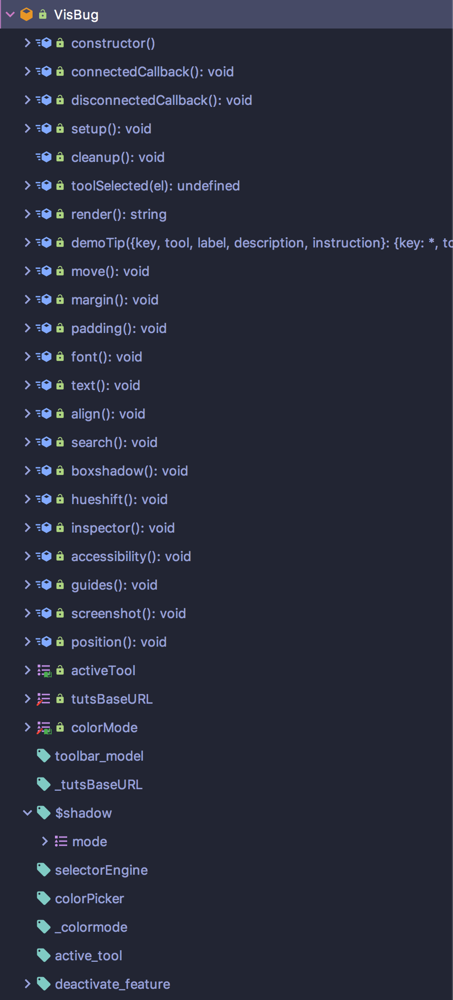
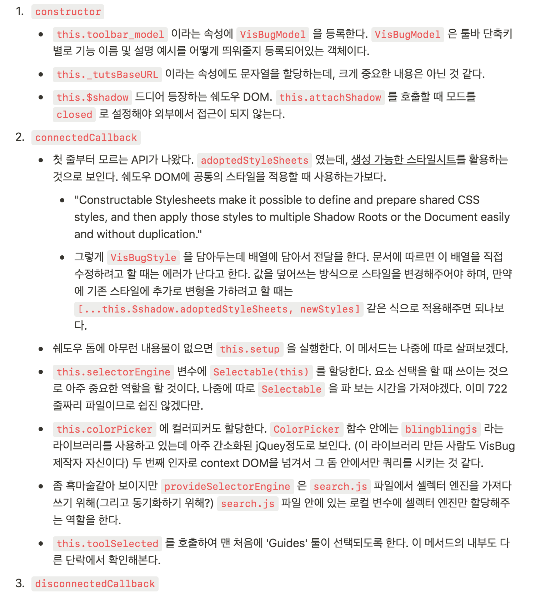

[앞선 글에서](https://rinae.dev/posts/how-to-contribute-oss) 왜 오픈소스에 기여할만한 가치가 있는지 설명했습니다. 저도 자잘한 버그 수정 등에 몇 번인가 기여한 적이 있습니다만, 조금씩 욕심이 생겨서 가능한 한 내가 어디까지 코드로 기여를 할 수 있는지 도전해보고 싶어졌습니다. 그러던 와중에 글로벌 전문 개발자 지원사업(구 오픈프론티어)에 대해 알게 되어, 추가 모집에 합격하여 7월부터 활동하고 있습니다.

활동을 시작하고 약 2달 동안 삽질을 좀 하고 개인 노트에 배웠던 내용을 조금 정리해 두었습니다만 굳이 개인 노트에만 모시고 있을 필요가 없다고 판단하여 제가 기여하게 된 이유와 기여하고 있는 과정을 포스팅으로 연재하고자 합니다.

## VisBug는 어떤 프로젝트인가

제가 기여하겠다고 신청한 프로젝트는 [VisBug](https://github.com/GoogleChromeLabs/ProjectVisBug)라는 프로젝트입니다. 간단히 설명하자면 디자이너를 위한 웹 프론트엔드 디버깅 툴이라고 할 수 있습니다. [작년 Chrome Dev Summit 2018에서 발표된 프로젝트입니다.](https://blog.chromium.org/2018/11/chrome-dev-summit-2018-building-faster.html)

현재 크로미움 기반 브라우저에서 크롬 웹스토어를 통해 확장 프로그램으로 설치하여 사용할 수 있으며 웹 페이지에서 확장 프로그램을 실행시키면 다음과 같은 동작을 수행할 수 있습니다.

- 엘리먼트의 세부 스타일 정보 혹은 접근성 정보를 툴팁 형태로 볼 수 있다
- 엘리먼트 사이의 간격 등을 자로 잰 듯 쉽게 확인할 수 있다
- Drag & Drop 형식으로 이미지를 교체해볼 수 있다
- 엘리먼트의 패딩, 마진을 자유자재로 조절해볼 수 있다
- 엘리먼트를 움직여볼 수 있다
- 엘리먼트의 테두리 색, 배경색 등을 변경해볼 수 있다
- 텍스트 내용 및 스타일을 변경해볼 수 있다
- 선택자를 입력하여 쉽게 엘리먼트를 찾아볼 수 있다
- 기타 등등

여기까지만 보신다면 개발자 입장에서 '이거 다 개발자 도구 직접 열어서 하면 되는거 아냐?' 라고 생각하실 수 있습니다. 예 대부분은 그렇죠. VisBug는 개발자 도구에서 바로 할 수 있는 일에 UI & UX를 강화시켰다고 볼 수 있습니다. 일부 없는 기능도 있고요.

저는 엘리먼트 사이의 간격이 제가 의도한대로 반영되었는지 확인할 때 가끔 [Page Ruler](https://chrome.google.com/webstore/detail/page-ruler/emliamioobfffbgcfdchabfibonehkme?hl=en)라는 확장을 사용했었습니다. (미리 경고하는데 **저 확장은 쓰지 마세요. 몰래 광고 스크립트가 심어지는 애드웨어입니다.** 만약에 저 확장을 쓰시고자 한다면 [Page Ruler Redux](https://chrome.google.com/webstore/detail/page-ruler-redux/giejhjebcalaheckengmchjekofhhmal?hl=en)를 사용하세요) 하지만 엘리먼트 사이의 간격은 쉽게 파악하기 어려웠는데, 마침 이 확장이 지원을 해 주더군요. Page Ruler를 삭제한 이후 엘리먼트 스타일이나 길이 등을 가볍게 확인하는 용도로 VisBug를 애용하고 있었습니다.

또한 개발자 도구에 친숙하지 않은 다른 직군의 동료분들에게(디자이너, QA 엔지니어) 이 도구를 소개해 주고 가끔씩 배포된 개발 페이지에 추가 배포를 하지 않고 다양한 레이아웃 실험을 해 보거나 엘리먼트에 스타일이 올바르게 적용되었는지 확인하는 용도로도 잘 사용하고 있었습니다.

마지막으로 이 프로젝트는 하나의 웹 애플리케이션입니다. 그리고 **웹 컴포넌트** 입니다. 한때 잠시 흥미를 가지고 웹 컴포넌트에 대해 공부하고 [발표를 한 적이 있었지만](https://youtu.be/qfp6AGcVnDQ) 실무에 그닥 유용하게 사용할 일이 없었습니다. 그도 그럴 것이 이미 몇 년째 리액트 위주로 프로젝트를 개발해왔고 리액트를 잘 다루는데만 해도 알아야 할 것이 꽤 많았기 때문입니다. 하지만 바닐라 자바스크립트에 [LitElement](https://lit-element.polymer-project.org)같은 프레임워크도 사용하지 않고 생으로 웹 컴포넌트를 만들어나가는 소스코드를 봤을 때 굉장히 재미있는 프로젝트라고 느꼈습니다.

자연스럽게 이전 글에 설명한대로 제가 오픈소스에 기여하기에 좋은 조건인

1. 업무에 사용하고 있으며
2. 재미가 있는

프로젝트였기에 한번 차근차근 기여를 해봐야겠다고 마음먹었습니다.

## 사전 조사

사전 조사라고 하지만 그리 대단한 일을 한 것은 아닙니다. 프로젝트에 있는 문서란 문서는 한 번 이상 훑어보는(가능하면 정독) 일부터 시작했습니다. 보통 규모가 좀 있는 프로젝트라면 아주 세밀하게 커밋 메세지 가이드까지 있는 경우가 있지만 이 프로젝트는 그렇지 않군요. 단순하게 기여를 해 주어서 고맙고 문의사항이 있다면 Gitter나 Spectrum에서 이야기를 나눌 수 있다고만 쓰여 있습니다.

그래도 최소한 프로젝트를 포크-클론하여 어떻게 개발모드를 실행시켜 볼 수 있는지는 안내하고 있네요. 여기서 미리 강조하고 싶은게 있는데, **"일단 개발모드를 실행시킬 수 있다면 일단 코드 아무 부분이나 조작해보고 느껴보라"** 고 말씀드리고 싶습니다. 제가 그렇게 안해서 한 달 정도 시간을 까먹었으니까요.

그리고 프로젝트 작성자가 이슈에 열심히 레이블을 매겨두었기 때문에 그 중에서 "good first issue" 레이블을 필터링하여 내가 상대적으로 쉽게 해볼만한 이슈들이 있나 살펴보았습니다. 뭔가 하나 눈에 들어오기 시작했습니다. 하지만 이미 프로젝트의 코드가 상당한 양으로 되어있고, 제가 평소에 접하던 코드와 많이 달랐기 때문에 무작정 부딪혀보기보다 프로젝트 작성자에게 문의를 해 보기로 했습니다.

저도 영어 쓰기가 듣기/읽기에 비해 많이 부족한 수준이지만 그래도 Grammarly + Papago를 이용하여 적당히 제 의도를 이메일로 전달할 수 있었고, 프로젝트 작성자에게 좋은 조언이나 피드백을 받을 수 있었습니다.

제가 이 프로젝트를 처음 접했을 때 느꼈던 어색한 부분들이 있었는데

1. 바닐라 자바스크립트로 된 프로젝트다
2. 코딩 가이드라인이 없는데 포매터, 린터 설정도 없다 (editorconfig는 있더군요)
3. 테스트 방식이 익숙지 않다 (ava + puppeteer)

2번이 제일 크게 신경쓰였지만 **"한번쯤 자신이 세워놓은 울타리를 내려놓고 코드로 자연스럽게 자신을 표현해보라"** 는 메일 답장을 받아들여 이미 작성되어있는 스타일 기반으로 자유롭게 코드를 작성해보기로 마음먹었습니다.

## 소스코드를 파헤쳐 보자

요즘 VSCode도 많이 좋아지긴 했지만, 타입스크립트 기반 프로젝트가 아니라 바닐라 자바스크립트 기반 프로젝트의 구조를 파헤치는데는 역시 JetBrains의 IDE(IntelliJ Ultimate, WebStorm)이 좋다고 생각합니다. 'Go To Definition' 기능이 더 정확하게 동작하기 때문입니다. 저는 WebStorm 라이센스를 구입하여 사용하고 있으므로 VisBug 프로젝트를 파헤칠 때 도움을 좀 받았습니다. 그 외에는 특정 파일에 진입하여 Outline 뷰를 켜고 클래스나 함수 내부에 어떤 메서드나 로컬 함수들이 있는지 살펴보고 어떤 기능을 하고있는지 살펴봤습니다. Outline 뷰는 VSCode도 WebStorm과 비등비등하게 잘 표시됩니다.

그리고 아마 브라우저로 Github를 열어놓고 보게 될 일도 있을텐데, 소스코드를 편하게 살펴보기 위해 아래의 브라우저 확장들을 추천합니다.

- [GitHub - ovity/octotree: GitHub code tree on steroids](https://github.com/ovity/octotree)
- [GitHub - OctoLinker/OctoLinker: OctoLinker — Links together, what belongs together](https://github.com/OctoLinker/OctoLinker)
- [Sourcegraph - Code search and intelligence](https://sourcegraph.com/) (오픈 소스 프로젝트는 무료로 이용 가능)

그리고 재빠르게 `src/index.js` 같은 파일을 찾아보고 어떤 파일이 불러와지는지 확인합니다. 보통 그 파일이 메인 함수 역할을 하겠죠. VisBug 프로젝트에는 `vis-bug.element.js` 라는 파일이 브라우저 확장을 실행할 때 마운트되는 루트 컴포넌트로 파악되었습니다.

개인 노트에는 이런 식으로 메서드를 분석/정리해봤습니다.

이런식으로 보다가 모르는 API가 나오면 바로 MDN 등을 검색해 보고, 몰랐던 것을 알면 정리를 덧붙여 점차 배경 지식을 늘려갑니다. 이 지식 습득이 모두 완료될 때까지 공부할 필요는 없습니다. 그냥 이리저리 코드를 주물러 보면서 생기는 변화에 따라 지식을 습득할 수도 있고, 실제로 그게 더 빠른 길입니다. 저는 여기까지 하고 '이제 이슈 해결을 위한 코드를 작성해보자' 라고 결심하는데까지 평일 퇴근하고, 주말까지 틈틈이 소스코드를 보면서 1개월 정도가 걸렸거든요.

## 이제 코드를 작성해보자

어차피 `upstream` 리모트 브랜치에 직접 푸시를 해버리지 않는 한(보통은 권한도 없을테지만) 브랜치를 따서 여러 가지 실험을 해 볼 수도 있을 테고, 특정 이슈를 해결하기 위한 최소한의 작업을 해 본 뒤에 프로젝트 메인테이너에게 문의해볼 수도 있습니다.

하지만 저는 '아직 이 이슈는 아무도 손대지 않았으니까' 라는 생각으로 딱히 별로 체크하지 않고 작업을 해서 PR을 올려보려 했는데, PR을 올려볼까 싶어서 이슈를 다시 확인해 보니 [이미 몇일 전에 다른 분이 작업을 완료하여 PR을 올려둔 상태였더군요(이유는 모르겠지만 다시 이슈가 열린 상태).](https://github.com/GoogleChromeLabs/ProjectVisBug/issues/36)

제가 앞서 강조한 **개발 모드만 동작한다면 로컬에서 여러 가지 방법으로 코드를 가지고 놀아보라** 고 이야기한 것과 더불어 어떤 이슈에 작업을 할 마음을 먹었다면 **혼자 조용히 작업하고 있지 말고 해당 이슈에 자신의 흔적을 남기고, 관찰해야 한다** 는 교훈을 얻었습니다. 예를 들어서 어떤 이슈를 해결해보고 싶은데 아무런 PR이나 코멘트가 없다 싶으면 "Mind if I try to help with this issue?" 같은 댓글을 남기고 "그럼 괜찮고말고" 같은 대답을 받아 작업을 차근차근 진행해 볼 수도 있겠습니다.

그리고 Spectrum, Gitter 같은 곳에 보통 메인테이너들은 상주하고 있으므로 궁금한 점이 있는데 문서화가 잘 되어있지 않아서 바로 답을 찾기 힘든 상황이라면 주저하지 말고 채팅방에 들어가서 질문을 해 볼수도 있겠습니다. 제가 초년생 때 [Hanami](https://hanamirb.org/) 프로젝트로 개발을 하면서 궁금할 때마다 Gitter 채팅방에 들어가서 질문을 남겼던 기억이 새록새록 나네요.

하지만 한 달동안 코드를 조사한 덕에 [상대적으로 연관이 있는 다른 이슈는 손쉽게 해결할 수 있었습니다.](https://github.com/GoogleChromeLabs/ProjectVisBug/pull/378)

## 코드 외에 기여를 하는 방법

또 다른 이슈를 해결할만한게 없나 하고 살펴보니 `window.getComputedStyle` 로 얻어낸 스타일 정보가 실제 CSS로 작성한 스타일 값과 일치하지 않는 버그가 있었습니다. 마침 코드 조사하면서 비슷한 문제를 겪어서 이상하다고 느끼고 있었으니 조금 더 자세하게 알아보기로 했죠.

그런데 알고 보니 이 문제는 버그가 아니라 [W3C 명세에 올라와있는 내용이더군요.](https://www.w3.org/TR/css-display-3/#transformations) 그래서 이런 식으로 이야기를 해봤습니다.

> "이거 실제로는 버그가 아니라 W3C 명세에 있는 내용인거 보니까, 굳이 애플리케이션 단위에서 무리하게 고쳐보려고 하지 말고 이슈를 마무리하면 어떨까요?"  

프로젝트 작성자는 제 의견을 받아들여 이슈를 닫았습니다. 짜잔. 이렇게 코드를 직접 작성하지 않고도 문제를 하나 해결(?) 하여 오픈소스 프로젝트에 기여하는데 성공했습니다.

- - - -

이런 방식으로 제 흥미가 계속 닿아있는 한 이런 방식으로 제가 얻게 된 경험을 글로 공유하고자 합니다. 기회가 된다면 발표로 만나뵐 수 있으면 좋겠네요.
