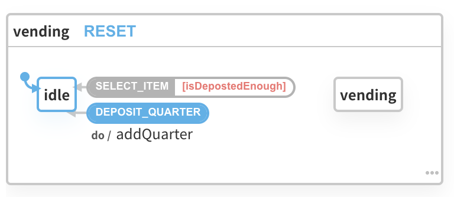
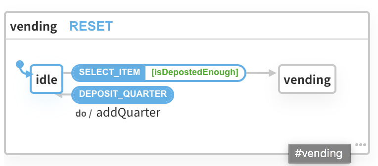
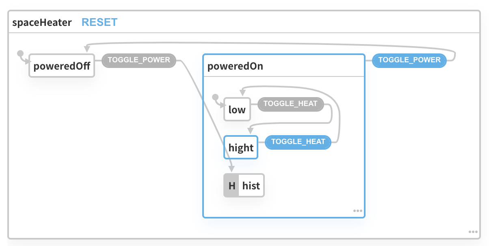
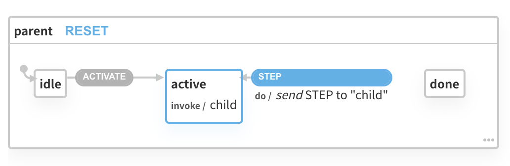
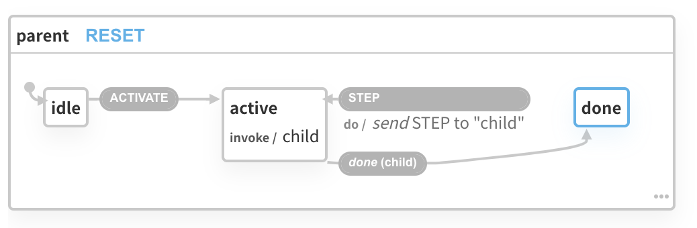

Egghead 의 [Introduction to State Machines Using XState](https://egghead.io/courses/introduction-to-state-machines-using-xstate)  강좌를 보고 내용을 정리  
이전에 상태 머신 기법을 활용한 에러 관리 방법에 대해 고민한 적도 있었고, XState 라는 라이브러리를 활용하는 것에 대해서도 관심이 있었기 때문에 이 강좌를 통해 좀 더 깊이 알아보려 한다.

## 상태를 열거하여 Boolean Explosion 제거하기

먼저 XState 를 활용하기 이전에, 상태 머신이라는 것이 어떤 상황에서 유용하게 사용될 수 있는지 알아본다. 대표적인 예가 특정 상황을 다루기 위해 많은 `boolean`  값의 플래그가 생길 때이다.

[Boolean Explosion](https://en.wikipedia.org/wiki/Combinatorial_explosion) 은 함수에 불린 값을 추가할 수록 관리해야하는 상태의 경우의 수가 `2^n`  이 되어 문제 상황이 일어나는 것을 의미한다. 아래와 같은 전구의 상태를 관리하는 함수가 있다고 가정해보자.

```js
function lightBulb() {
  let isLit = false
  let isBroken = false

  return {
    state() {
      return {isLit, isBroken}
    },
    toggle() {
      isLit = !isLit
    },
    break() {
      isBroken = true
    },
  }
}

const bulb = lightBulb()
const log = () => {
  console.log(bulb.state())
}

bulb.toggle()
bulb.break()
log() // => { isLit: true, isBroken: true }
```

`bulb.break()` 를 수행하고 나면 전구는 켜지지 않는 것을 바라겠지만, 그런 처리를 해 두지 않았다. 만약에 `break` 가 수행된 다음에 전구가 켜지면 안된다는 로직을 실행하고 싶다면 `toggle` 메서드를 수정하여 `isBroken` 상태에 대한 가드를 수행해주어야 한다.

```js
isBroken() {
  if (isBroken) {
    isLit = false
    return
  }
  // ...
}
```

하지만 이런식으로 다루어야 하는 상태의 가짓수가 많아질 수록 신경써야 할 것이 많아지는데 비해 상태 자체를 열거형으로 변환하여 다루면 한결 수월해진다.

```js{15-21}
const STATES = {
  lit: 'lit',
  unlit: 'unlit',
  broken: 'broken',
}

function lightBulb() {
  let state = STATES.unlit

  return {
    state() {
      return state
    },
    toggle() {
      switch (state) {
        case STATES.unlit:
          state = STATES.lit
          break
        case STATES.lit:
          state = STATES.unlit
          break
        default:
          break
      }
    },
    break() {
      state = STATES.broken
    },
  }
}
```

보다시피 표현 가능한 상태를 하나만 두고, 전구가 깨진 상태와 전구에 불이 들어온 상태가 함께 관리되어 복잡한 문제를 쉽게 해결할 수 있게 되었다.

## 열거형 상태를 상태 머신으로 바꾸기

바로 이어서 위의 코드를 XState 기반의 상태 머신으로 변경해본다. 메서드를 통해 호출하는 방식을 벗어나 이벤트를 호출하여 그 이벤트가 일어난 다음의 상태를 불변 상태로 리턴해준다는 특징을 가지고 있다.

```js
import {Machine} from 'xstate'

const lit = {
  on: {
    BREAK: 'broken',
    TOGGLE: 'unlit',
  },
}
const unlit = {
  on: {
    BREAK: 'broken',
    TOGGLE: 'lit',
  },
}
const broken = {
  type: 'final',
}

const states = {lit, unlit, broken}
const initial = 'unlit'

const config = {
  id: 'lightBulb',
  initial,
  states,
}

const lightBulbMachine = Machine(config)
```

`states`  에 각 상태별로 받는 이벤트와 이벤트가 일어난 후의 상태를 표현하고 있다. `broken` 이 `type: 'final'`  로 표시되어 있는 것은, 이 상태 머신의 마지막 상태임을 뜻하기 때문이다. 아래와 같이 `transition` 을 통해 두 개의 인자를 넘기는데 `(기준이 되는 상태, 이벤트)` 방식으로 전달을 한다.

```js
console.log(lightBulbMachine.transition('lit', 'TOGGLE').value) // => 'unlit'
console.log(lightBulbMachine.transition('unlit', 'BREAK').value) // => 'broken'
```

인자를 문자열 값으로 전달해준다는 한계가 있는데, 첫 번째 인자의 문자열이 사전에 `config` 에 전달된 대로 입력되지 않았으면 에러가 발생한다. 이벤트 이름이 잘못된 경우에 기본적으로 에러가 나타나지 않지만 `config` 에 `strict: true` 를 지정해두면 트랜지션 시 이벤트 이름이 맞지 않을 때 에러가 발생한다.

## 머신을 다루기 위해 인터프리터 사용

`Machine.transition` 은 꽤나 저수준 API 로 보인다. 기준이 되는 상태와 이벤트를 같이 전달해야 하기 때문이다. XState 는 쉽게 머신을 다루기 위해 `interpreter` 라는 함수를 제공한다. 인터프리터에 머신을 전달해주면 그 머신을 다룰 수 있는 서비스를 리턴한다.

```js
import {Machine, interpret} from 'xstate'

// 위와 같은 lightBulbMachine 을 사용
const services = interpret(lightBulbMachine).start()

// send 메서드로 이벤트를 전달하면 기준 상태에서 다음 상태로 변화한다.
services.send('TOGGLE')
let nextState = services.state
console.log(nextState.value) // => 'lit'
services.send('TOGGLE')
nextState = services.state
console.log(nextState.value) // => 'unlit'
services.send('BREAK')
nextState = services.state
console.log(nextState.value) // => 'broken'
```

다음 상태를 일일이 이렇게 가져올 필요도 없거니와 변화할 때만 처리하게 만들려면 `onTransition` 이벤트 리스너를 걸어버릴 수 있다. 아래의 예는 `onTransition` 을 활용하여 `BREAK` 이벤트가 발생했을 때 콘솔을 출력해주는 예이다.

```js
// 이벤트 핸들러에 전달되는 state 는 changes, matches 등 다양한 속성을 가지고 있고 이를 활용할 수 있다.
services.onTransition(state => {
  if (state.matches('broken')) {
    console.log("Yo! I 'm broke!")
  }
})
```

## XState Viz 를 활용하여 시각화된 상태 머신 개발하기

Redux Devtools 처럼, XState 도 고유의 시각화된 개발자 도구가 존재한다. [이 링크](https://xstate.js.org/viz/)로 접속하면 된다. 간단히 정리하면 아래의 기능을 가지고 있다.

- 정의된 상태 머신을 시각화하여 표현
- 시각화된 머신의 이벤트를 클릭하여 변화되는 모양을 볼 수 있음
- 타임스탬프와 함꼐 일어난 이벤트를 관찰하는 등의 실험을 해볼 수 있음
- Github ID 를 이용하여 사이트에 로그인하고, 정의한 상태 머신을 저장하면 Github Gist 에 업로드됨

이후의 강좌는 대부분 XState Viz 사이트를 통해 진행되므로, 만약 코드를 실습해보거나 디버깅한다면 XState Viz 를 적극 활용해보는 것을 권장한다. 조금 아쉬운 것은 타입스크립트 코드를 그대로 옮겨 사용할 수는 없다는 것이다. 나는 코드 작성은 편하게 codesandbox 를 띄워놓고 한 다음, XState Viz 에 복붙하여 도표를 보는 식으로 진행해보았다.

## 사이드 이펙트를 일으키기 위해 트랜지션에 액션 추가하기

XState 에서 액션은 트랜지션 후에 "일어나고 잊혀지는" 사이드 이펙트(부수 효과)를 뜻한다. 이를 지정하기 위해 위의 `lightBulb` 머신의 정의를 약간 수정할 필요가 있다.

```js{13}
const lightBulbMachine = Machine({
  id: 'lightBulb',
  initial: 'unlit',
  states: {
    lit: {
      on: {
        BREAK: 'broken',
        TOGGLE: 'unlit',
      },
    },
    unlit: {
      on: {
        BREAK: 'broken', // => 이 부분을 변경 예정
        TOGGLE: 'lit',
      },
    },
    broken: {
      type: 'final',
    },
  },
})
```

특정 이벤트 이름에 바로 `'broken'` 을 써 넣는 것은 실제로는 `{target: 'broken'}` 라는 객체를 할당하는 대신 축약한 것이다. 이 객체에 다양한 속성을 넘겨줄 수 있는데, `actions` 도 그 중 하나이다. `actions` 는 일어날 사이드 이펙트를 단일 함수 혹은 함수의 배열로 받으며, 각 함수는 `(context, event) => any | void` 의 시그니처를 가지고 있다.

```js{6}
// ...
unlit: {
  on: {
    BREAK: {
      target: 'broken',
      actions: [(context, event) => console.log('Yo I am broke!'), // ...]
    }
    // ...
  }
}
```

이런 액션이 만약 공통적으로 사용된다면, 머신을 생성할 때 두 번째 인자로 옵션을 전달해줄 때 거기에 사전에 정의된 액션을 전달해줄 수 있다. 그러면 각 이벤트에서는 액션의 이름을 문자열로 기록해두기만 하면 된다.

```js{9-10,29-34}
const lightBulbMachine = Machine({
  id: 'lightBulb',
  initial: 'unlit',
  states: {
    lit: {
      on: {
        BREAK: {
          target: 'broken',
          // 2. 정의된 액션을 사용
          actions: ['logBroken']
        },
        TOGGLE: 'unlit',
      },
    },
    unlit: {
      on: {
        BREAK: {
          target: 'broken',
          actions: ['logBroken']
        },
        TOGGLE: 'lit',
      },
    },
    broken: {
      type: 'final',
    },
  },
}, {
  // 1. 여기서 따로 액션 정의
  actions: {
    logBroken: (context, event) => {
      console.log(`Yo I'm broke in the ${event.location}`)
    }
  }
})
// ...
service.send({type: 'BREAK', location: 'Home'}) // => 'Yo I'm broke in the Home'
```

## 상태를 빠져나가거나 벗어날 때 액션을 실행하기

위에서 `lit`, `unlit` 상태 모두 `BREAK` 상태가 될 때 특정 액션을 수행하도록 지정했다만, 코드가 불필요하게 복잡해지는 느낌이 들 것이다. 실제로는 `broken` 상태로 진입할 때 액션이 수행되면 될텐데 말이다. 이를 위해 상태 정의 시 `entry` 라는 속성을 부여하고 위와 같은 방식의 시그니쳐로 액션 이름 혹은 액션 함수를 전달해줄 수 있다. 반대로 `exit` 이라는 속성도 활용가능하다.

```js{6-11,15-16,23-24}
const lightBulbMachine = Machine(
  {
    // ...
    states: {
      lit: {
        // 1. lit 상태를 빠져나올 때 실행됨
        exit: [
          () => {
            console.log('It is so dark and cold...')
          },
        ],
        on: {
          BREAK: {
            target: 'broken',
            // 2. broken 상태로 전환되면서 실행됨
            actions: ['doSomething'],
          },
          TOGGLE: 'unlit',
        },
      },
      // ...
      broken: {
        // 3. broken 상태에 진입할 때 실행됨
        entry: ['logBroken'],
        type: 'final',
      },
    },
  },
  // ...
)
```

실제로 이 액션들은 아래의 순서를 지켜 실행된다.

1. 특정 상태를 빠져나갈 때 `exit` 의 액션이 실행된다.
2. 트랜지션이 일어날 때 지정한 `actions` 에 지정된 액션이 실행된다.
3. 타겟 상태에 진입하고, `entry` 에 정의된 액션이 실행된다.

## 내부 트랜지션을 활용하여 불필요한 상태 재진입을 막기

XState 의 트랜지션에는 두 종류가 있다. "외부" 와 "내부" 트랜지션이다.

- 외부 트랜지션: 트랜지션 시 현재 상태 노드에서 "빠져나오고" 다음 상태 노드에 "진입하는" 루프가 일어난다. 이는 위에서 살펴봤던 `exit`, `entry` 액션이 발동한다는 뜻이다.
- 내부 트랜지션: `.idle` 같이 상태 타겟 이름 맨 앞에 `.` 점을 붙여서 지정할 수 있다. 내부 트랜지션은 상태 변화는 일어나지만 `exit/transition/entry` 루프가 일어나지 않는다.

```js{12}
const idleMachine = Machine(
  {
    id: 'idle',
    initial: 'idle',
    states: {
      idle: {
        entry: 'logEntry',
        exit: 'logExit',
      },
    },
    on: {
      DO_NOTHING: '.idle' // 문자열 맨 앞의 .(콤마) 에 주목
    }
  },
  {
    actions: {
      logEntry: () => console.log('entered'),
      logExit: () => console.log('exited'),
    },
  }
)

const services = interpret(idleMachine).start()

services.send('DO_NOTHING') // => 콘솔에 찍히는 것 없음
```

## Send 액션 크리에이터를 이용하여 이벤트를 머신에 전달하기

특정 액션이 일어날 때 별도의 동작이 함께 수행되도록 만들기 위해 `actions` 에 대해 알아보았다. 이를 별도의 이벤트 이름에 저장해두고, `send` 라는 함수를 통해 호출할 수도 있다.

아래의 코드는 `SPEAK` 이벤트를 일으켰을 때 덩달아 `ECHO` 이벤트도 일으켜서 부수효과가 연달아 일어나도록 하는 예이다.

```js{10}
import {Machine, interpret, send} from 'xstate'

const echoMachine = Machine({
  id: 'echo',
  initial: 'listening',
  states: {
    listening: {
      on: {
        SPEAK: {
          actions: send('ECHO'), // send({type: 'ECHO'}) 같은 형태도 가능
        },
        ECHO: {
          actions: () => console.log('echo, echo ...'),
        },
      },
    },
  },
})

const services = interpret(echoMachine).start()

services.send('SPEAK') // echo, echo ....
```

## 무한 상태를 Context 로 관리하기

XState 는 기본적으로 유한 상태 머신 라이브러리지만, 별도로 무한으로 관리되는 상태가 존재할 수 있다. 이를 "확장된 상태" 라고 표현하고, `context` 라고 불린다. `context` 는 기본적으로 머신의 상태와는 별개의 상태로 여길 수 있겠다.

`context` 를 다룰 때는 머신 선언 시 해당되는 속성값을 표현해주고, 특정 이벤트 발생 시 `assign` 을 통해 변경을 가해주면 된다.  `assign` 을 호출할 때 함수를 넘겨줄 수도 있고, 객체를 넘겨줄 수도 있고 방법은 다양한데, 이는 [문서를 참고해보기 바란다](https://xstate.js.org/docs/guides/context.html#assign-action). 아래의 예제는 사전에 정의된 액션을 `assign` 으로 호출하는 예이다.

```js{7-10,32-35}
import {Machine, interpret, assign} from 'xstate'

const multiColorBulbMachine = Machine(
  {
    id: 'multiColorBulb',
    initial: 'unlit',
    // context 속성 선언
    context: {
      color: 'white',
    },
    states: {
      lit: {
        on: {
          BREAK: 'broken',
          TOGGLE: 'unlit',
          CHANGE_COLOR: {
            actions: ['changeColor'],
          },
        },
      },
      unlit: {
        on: {
          BREAK: 'broken',
          TOGGLE: 'lit',
        },
      },
      broken: {},
    },
  },
  {
    actions: {
      // 새 값을 context 에 할당
      changeColor: assign((context, event) => ({
        color: event.color,
      })),
    },
  }
)

const services = interpret(multiColorBulbMachine).start()

services.send('TOGGLE')
services.send({type: 'CHANGE_COLOR', color: 'red'})
console.log(services.state.context.color) // red
```

## 액션의 순서가 Context 의 값을 바꾸는 원리

아래와 같이 `doubleCounterMachine`  이 있다고 하자. `INC_COUNT_TWICE` 이벤트 발생 시 `actions` 선언부를 보면 액션이 일어나기 전의 값을 표시하고, `incCount` 를 두 번 호출한 다음 변화한 값을 표시하고 있다. 하지만 실제 코드를 실행시켜보면 의도와는 다른 값이 나온다.

```js
const doubleCounterMachine = Machine(
  {
    id: 'doubleCounter',
    initial: 'idle',
    context: {
      count: 0,
    },
    states: {
      idle: {
        on: {
          INC_COUNT_TWICE: {
            actions: [
              ctx => console.log(`before: ${ctx.count}`),
              'incCount',
              'incCount',
              ctx => console.log(`after: ${ctx.count}`),
            ],
          },
        },
      },
    },
  },
  {
    actions: {
      incCount: assign((context, event) => ({
        count: context.count + 1,
      })),
    },
  }
)

const services = interpret(doubleCounterMachine).start()

services.send('INC_COUNT_TWICE')
// 실제 콘솔에 표시되는 값
// before: 2
// after: 2
```

구현대로라면 `before: 0` 이 나오기를 기대했을 것이다. 이는 XState 의 트랜지션이 순수 함수로 이루어져 있고, 순수성을 유지하기 위해 assign 이 일어나는 액션을 먼저 반영해두는 특징을 가지고있기 때문이다. 의사 코드로 표시하자면 아래와 같다.

```js{10-13}
Machine.transition(state, event)

{
  context: nextContext,
  actions: [
    ...state.exit,
    ...actions,
    ...nextState.entry
  ].filter(action => {
    if (assignAction) {
      mergeIntoNextContext()
      return false
    }
    return true
  }),
}
```

따라서 액션이 일어날때마다 이전 상태를 기억하지 않기 때문에, 이전 상태를 기록해두기 위한 별도의 상태를 선언해야한다. 여기서는 `previousCount` 라는 값을 활용해보기로 한다.

```js{13-20}
const doubleCounterMachine = Machine(
  {
    id: 'doubleCounter',
    initial: 'idle',
    context: {
      count: 0,
      previousCount: undefined,
    },
    states: {
      idle: {
        on: {
          INC_COUNT_TWICE: {
            actions: [
              // undefined 가 뜰 것 같지만, 위에 설명한대로 assign 액션이 먼저 수행된다.
              ctx => console.log(`before: ${ctx.previousCount}`),
              'setPreviousCount',
              'incCount',
              'incCount',
              ctx => console.log(`after: ${ctx.count}`),
            ],
          },
        },
      },
    },
  },
  {
    actions: {
      incCount: assign(ctx => ({
        count: ctx.count + 1,
      })),
      setPreviousCount: assign(ctx => ({
        previousCount: ctx.count,
      })),
    },
  }
)
// INC_COUNT_TWICE 를 실행하면 ...
// before: 0
// after: 2
```

## Activity 를 사용하여 계속 진행되는 사이드 이펙트 실행하기

여태까지 살펴보았던 `actions` 속성은 상태 트랜지션이 일어날 때 한 번만 실행된다. 만약 계속 진행되어야 하는 사이드 이펙트를 관리하고 싶다면 `activities` 라는 속성을 사용해야 한다. 원리는 리액트 사용자라면 `useEffect` 와 약간 유사하게 느껴질 수 있다. 상태 진입 시 실행되는 액티비티가 있고, 해당 상태를 벗어날 때 클린업하는 함수를 미리 리턴문으로 선언해두면 된다.

아래는 알람 시계와 비슷하게 동작하여 `alraming` 상태일 때 알람을 멈출 때까지 계속 `beep` 이 표시되도록 구현한 예이다. `setInterval` 을 사용하였으며, 다른 상태로 변화할 때 `clearInterval` 이 실행될 것이다.

```js{12,22}
const alarmClockMachine = Machine(
  {
    id: 'alarmClock',
    initial: 'idle',
    states: {
      idle: {
        on: {
          ALARM: 'alarming',
        },
      },
      alarming: {
        activities: ['beeping'], // actions 가 아니라 activities 로 바뀐데 주목
        on: {STOP: 'idle'},
      },
    },
  },
  {
    activities: {
      beeping: () => {
        const beep = () => console.log('beep')
        const intervalId = setInterval(beep, 1000)
        return () => clearInterval(intervalId) // 클리어해주지 않으면 매모리 누수가 발생한다.
      },
    },
  }
)

const services = interpret(alarmClockMachine).start()

services.send('ALARM')

setTimeout(() => {
  console.log('stopping')
  services.send('STOP')
}, 5000)
// 대강 5번정도 beep 가 출력되고 멈춘다.
```

## 가드 구문을 사용하여 조건부로 트랜지션이 일어나도록 제어하기

상태를 변경하고자 할 때 보통 언제나 A  -> B 로 행복하게 변경이 가능하진 않을 것이다. 특정 조건을 만족시키지 못한다면 다음 상태로 진입하지 못하도록 제어가 필요하다. XState 는 이를 `cond`, `guards` 등으로 제어할 수 있다.

특정 아이템이 일어날 때 어떤 상태로 전환되어야하는지 알려주는 객체를 지정해줄 때 `cond` 라는 속성에 `(context, event) => boolean` 시그니처의 함수를 전달해주면 된다. 물론 매번 속성마다 이를 전달해줄 필요를 없애기 위해 `guards` 라는 속성을 사전에 선언해두고 문자열 값으로 지정해두는 것도 가능하다.

아래는 자판기 로직을 `cond`, `guards` 를 활용하여 구현한 예이다. XState  Visualizer 를 통해 살펴보면 조건에 만족하지 않은 액션은 실행되지 않는 모습을 볼 수 있다.

```js{13,29-31}
const vendingMachine = Machine(
  {
    id: 'vending',
    initial: 'idle',
    context: {
      deposited: 0,
    },
    states: {
      idle: {
        on: {
          SELECT_ITEM: {
            target: 'vending',
            cond: 'isDepostedEnough',
          },
          DEPOSIT_QUARTER: {
            actions: ['addQuarter'],
          },
        },
      },
      vending: {},
    },
  },
  {
    actions: {
      addQuarter: assign(ctx => ({
        deposited: ctx.deposited + 25,
      })),
    },
    guards: {
      isDepostedEnough: ctx => ctx.deposited >= 100,
    },
  }
)
```




## 계층적 상태 관리하기

상태가 복잡해지면 한 계층의 평탄한 상태로는 관리하기 어려워지는 상황이 생긴다. 당연히 XState 로 계층적 상태를 만드는 것이 가능하다.

이 하위 계층에서 상위 계층의 상태로 전환하는 모양새가 조금 흥미로운데, 상태 머신을 만들 때 반드시 넣어주는 값인 `id` 를 이용하여 `#id.state` 방식으로 파고들 수 있다. 상태 머신 최상위에 `id` 를 써 주는 것 말고도, 특정 계층의 상태에도 `id` 값을 지정해줄 수 있다.

```js{12,15}
const doorMachine = Machine({
  id: 'door',
  initial: 'locked',
  states: {
    locked: {
      id: 'locked',
      on: {UNLOCK: 'unlocked'},
    },
    unlocked: {
      initial: 'closed',
      // 이 아래에도 states 가 선언된 것을 주목
      states: {
        closed: {
          on: {
            LOCK: '#locked', // states.locked.id 에 있는 값
            OPEN: 'opened',
          },
        },
        opened: {
          on: {CLOSE: 'closed'},
        },
      },
    },
  },
})
```

## 동시에 존재해야하는 상태를 관리하기

길을 걸으며 말을 하는 것 처럼 두 상태가 동시에 관리되어야 하는 경우도 있다. 이 경우에 서로에게 영향을미치는 상태가 아니라는 점이 주목할만하다. 말을 하던 하지 않던 걷는 것은 가능하니까.

이렇게 동시에 일어나면서 서로에게 영향을 미치지 않는 상태를 "평행 상태(parallel states)" 라고 한다. 이 평행 상태를 만들기 위해서 상태의 `type` 을 `parallel` 로 지정해주고 초기 상태(`initial`)를 제거해주면 된다.

먼저 아래와 같은 전기 히터가 있다고 생각해보자. 전원이 켜진 상태에서 온도를 올리고 내리는 기능을 가지고 있다.

```js
const spaceHeater = Machine({
  id: 'spaceHeater',
  initial: 'poweredOff',
  states: {
    poweredOff: {
      on: {TOGGLE_POWER: 'poweredOn'},
    },
    poweredOn: {
      on: {TOGGLE_POWER: 'poweredOff'},
      initial: 'lowHeat',
      states: {
        lowHeat: {
          on: {TOGGLE_HEAT: 'highHeat'},
        },
        highHeat: {
          on: {TOGGLE_HEAT: 'lowHeat'},
        },
      },
    },
  },
})
```

만약 여기에 '회전' 이라는 기능이 들어가면 어떻게 될 것인가? 회전 기능은 온도가 높은 상태인지 낮은 상태인지 전혀 분간할 필요가 없다. 그냥 본체가 좌우로 회전하면서 전체 공간을 더 데워줄 뿐이다. 이 상태(영어로 oscillating)가 동시에 적용될 수 있도록 만들어본다.

```js{10}
const spaceHeater = Machine({
  id: 'spaceHeater',
  initial: 'poweredOff',
  states: {
    poweredOff: {
      on: {TOGGLE_POWER: 'poweredOn'},
    },
    poweredOn: {
      on: {TOGGLE_POWER: 'poweredOff'},
      type: 'parallel', // parallel 타입으로 선언
      states: {
        heated: {
          initial: 'lowHeat',
          // 계층 상태 구성 시 `states` 입력에 주의
          states: {
            lowHeat: {
              on: {TOGGLE_HEAT: 'highHeat'},
            },
            highHeat: {
              on: {TOGGLE_HEAT: 'lowHeat'},
            },
          },
        },
        oscillation: {
          initial: 'disabled',
          states: {
            enabled: {
              on: {TOGGLE_OSC: 'disabled'},
            },
            disabled: {
              on: {TOGGLE_OSC: 'enabled'},
            },
          },
        },
      },
    },
  },
})
```

위와 같이 상태 머신을 만들어 시각화 도구에서 확인해보면, `TOGGLE_HEAT` 이벤트와 `TOGGLE_OSC` 이벤트가 서로 연관없는 상태에 영향을 주지 않는 것을 확인할 수 있다.

## History 상태 노드로 이전 상태를 되돌리기

일반적으로 상태 머신은 시간 개념이 있어서는 안되지만, XState 는 나름 편의성을 위해서인지 이전 상태를 담아두는 기능을 자체적으로 가지고 있다. 위의 단락에서 `type: 'parallel'` 같이 상태를 선언한 것 처럼 특정 상태가 이전의 상태를 참조할 수 있도록 만들려면 `type: 'history` 로 만들면 된다.

먼저 아까 만들었던 `spaceHeater` 머신을 떠올려보고, 여기에 히스토리 타입의 상태를 지정해본다. `hist` 라는 상태를 지정했고, 이 상태를 가져다 쓰기 위해 타겟 상태 이름은 `poweredOn.hist` 처럼 문자열인데 객체 탐색 형테로 지정해주면 된다.

```js{6,18-20}
const spaceHeater = Machine({
  id: 'spaceHeater',
  initial: 'poweredOff',
  states: {
    poweredOff: {
      on: {TOGGLE_POWER: 'poweredOn.hist'},
    },
    poweredOn: {
      on: {TOGGLE_POWER: 'poweredOff'},
      initial: 'low',
      states: {
        low: {
          on: {TOGGLE_HEAT: 'high'},
        },
        high: {
          on: {TOGGLE_HEAT: 'low'},
        },
        hist: {
          type: 'history',
        },
      },
    },
  },
})
```



여기서 히스토리 상태 노드가 담아두는 이전 상태는 기본적으로 얕은 카피이다. 만약 이전 단락처럼 좀 더 깊은 상태(히터의 온도 + 회전 상태)를 디루어야 한다면 히스토리 타입 선언 시 아래와 같이 단계를 지정해주어야 한다.

```js
{
  type: 'history',
  history: 'deep'
}
```

## Null 이벤트를 이용하여 즉시 일어나는 트랜지션 만들기

다음 상태가 특별한 이벤트를 수신할 필요가 없는 경우 Null 이벤트를 정의하여 즉시 해당 상태에 도달하자마자 다음 상태로 트랜지션을 일으킬 수 있다. 조건에 따른 분기를 태운다거나 하는 용도로 활용하기 좋다.

Null 이벤트는 이벤트 이름에 빈 문자열(`''`) 을 지정하는 것으로 만들 수 있다. 조건에 만족하지 않는다면 바로 지정된 상태로 트랜지션 시켜버리는 것도 가능할 것이다. 아래의 예를 보면, `idle` 상태에서 `trying` 상태로 전환될 때 `success` 로 갈 조건이 맞지 않으면 `idle` 로 돌려보내는 모습을 볼 수 있다.

```js{17}
const tryTryAgainMachine = Machine(
  {
    id: 'tryTryAgain',
    initial: 'idle',
    context: {
      tries: 0,
    },
    states: {
      idle: {
        on: {TRY: 'trying'},
      },
      trying: {
        entry: ['incTries'],
        on: {
          // triedEnough 조건에 만족하지 않는다면 자동으로 'idle' 상태로 되돌아간다.
          // 조건에 만족한다면 자동으로 'success' 상태로 전환된다.
          '': [{target: 'success', cond: 'triedEnough'}, {target: 'idle'}],
        },
      },
      success: {},
    },
  },
  {
    actions: {
      incTries: assign(ctx => ({
        tries: ctx.tries + 1,
      })),
    },
    guards: {
      triedEnough: ctx => ctx.tries > 3,
    },
  }
)
```

## 이벤트와 트랜지션에 딜레이 주기

이벤트 발생에 딜레이를 주는데 사용자가 특별히 조작을 해줄 부분은 없고, 상태 선언 시 `after` 라는 속성으로 제어가 가능하다. 이 속성은 이전에 머신의 상태를 선언할 때 `on` 이라는 속성에 입력했던 것 대신 `after` 속성을 입력해주고, key 부분에 원하는 시간을 넣고 value 에 타겟 이벤트를 입력해주면 된다.

그런데 시간을 하드코딩하여 입력하는 것은 번거로운데다, 독립적인 의미를 가진 상수로서 딜레이를 입력하고 싶을 수 있다. `cond` -> `guards` 의 관계와 같이 머신 생성 시 config 객체로 `delays` 를 넘겨줄 수 있다. 여기서 특정 타이머에 대한 이름과 값을 넣어주면 된다.

아래의 예는 위에 설명한 내용대로 신호등 머신을 구현한 것이다.

```js{8-10,24-30}
const stoplightMachine = Machine(
  {
    id: 'stoplight',
    initial: 'red',
    states: {
      green: {
        // 'on' 이 사용되지 않은 것을 주목
        after: {
          GREEN_TIMER: 'yellow',
        },
      },
      yellow: {
        after: {
          YELLO_TIMER: 'red',
        },
      },
      red: {
        after: {
          RED_TIMER: 'green',
        },
      },
    },
  },
  {
    delays: {
      GREEN_TIMER: 3000,
      YELLO_TIMER: 1000,
      RED_TIMER: 4000,
    },
  }
)
```

물론 `delays` 를 활용하는 이유는 이것 뿐만이 아니다. 값을 상수로만 넣는 것이 아니라 함수를 적용할 수 있다. `context` 에 따라 타이머 값이 일정한 크기로 늘거나 줄어들게 할 수 있다는 뜻이다.

만약 저 신호등 머신에 혼잡 시간 처리를 위한 로직을 넣는다고 해보자. 혼잡 시간에 따라 타이머 시간을 n배씩 늘려주는 식으로 만들 수 있다. 먼저 `delays` 에 선언된 타이머들을 `ctx => number` 형태의 함수로 바꾸어준다.

```js
// 머신 선언부
// ...
  context: {
    rushHourMultiplier: 1,
  },
// 옵션 선언부
  {
    delays: {
      GREEN_TIMER: ctx => ctx.rushHourMultiplier * 3000,
      YELLO_TIMER: ctx => ctx.rushHourMultiplier * 1000,
      RED_TIMER: ctx => ctx.rushHourMultiplier * 4000,
    },
  }
// ...
```

그 다음에 저 `rushHourMultiplier` 를 증감시켜줄 수 있는 액션을 머신 선언부에 바로 구현하면 된다. 특정 상태와 바인딩되는 것이 아니라 머신 자체에 바인딩되는 이벤트이기 때문이다. 이는 위의 강좌 내용을 따라왔다면 충분히 구현 가능하리라 여겨 생략한다.

## Promise를 사용하는 비동기 상태 트랜지션을 일으키기

아마 이런 상태 관리 라이브러리류를 사용하면서 가장 관심을 많이 보이게 되는 부분 중 하나는 '그래서 결국 비동기 이벤트는 어떻게 처리하는건데?' 가 될 것이다. 이번 단락과 직접적인 관련은 없지만 흥미로운 점은 `Promise` 객체도 일종의 상태 머신의 특성을 띈다는 것이다 `pending`, `resolved`, `rejected`  같이 말이다.

이번에는 `invoke` 라는 속성을 선언하여 비동기 상태를 다룰 수 있다. 먼저 가장 기본적인 형태로 reddit 의 공개 API 를 활용한 `cuteAnimalsMachine` 의 껍데기를 구현해본다.

```js{18}
// 임의로 데이터를 가져오기 위한 함수. 다른 어느 공개 API 를 가져다 써도 상관 없다.
const fetchCuteAnimals = () =>
  fetch('https://www.reddit.com/r/aww.json')
    .then(res => res.json())
    .then(data => data.data.children.map(child => child.data))

const cuteAnimalMachine = Machine({
  id: 'cuteAnimals',
  initial: 'idle',
  context: {
    cuteAnimals: null,
    error: null,
  },
  states: {
    idle: {
      on: {FETCH: 'loading'},
    },
    loading: {}, // 여기에 비동기 로직이 작성될 예정
    success: {
      type: 'final',
    },
    failure: {
      on: {RETRY: 'loading'},
    },
  },
})
```

`loading` 부분에 다음과 같이 `invoke` 속성과 그에 따른 동작을 구현해준다. `invoke` 사용 시 `id` 속성과 `src` 를 활용해야 한다는 것을 잊지 말아야 한다.

```js{5,7,13}
// ...
    loading: {
      invoke: {
        id: 'fetchCuteAnimals',
        src: fetchCuteAnimals, // 위에 선언해놨던 데이터 가져오는 함수
        onDone: {
          target: 'success', // 성공 후 어느 상태로 전환할 것인가?
          actions: assign({
            cuteAnimals: (ctx, event) => event.data, // 성공 혹은 실패 시 이벤트의 `data` 속성으로 데이터가 전달된다.
          }),
        },
        onError: {
          target: 'failure', // 실패 후 어느 상태로 전환할 것인가?
          actions: assign({
            error: (ctx, event) => event.data,
          }),
        },
      },
    },
// ...
```

이번에는 바로 `assign` 을 하는 방식으로 상태를 선언해보았지만, 이전 내용 처럼 머신 생성 시 config 로 액션을 만들어 전달해 주는 것도 얼마든지 가능할 것이다. 자세한 사항 및 다른 예는 [이 공식 문서 내용을](https://xstate.js.org/docs/guides/communication.html#invoking-promises) 참고하면 된다.

## 부모 머신으로부터 이벤트를 주고받기 위해 콜백을 실행하기

초기에 설명했던 `on` 과 `actions` 같은 속성과 달리 `invoke` 는 콜백을 실행할 수도 있다. 이 콜백을 실행하는 것은 나중에 설명될 부모/자식 사이에 이벤트 및 콜백을 전달하는데 유용하게 사용될 것 같으나, 먼저 하나의 머신 안에서 사용하는 방법을 살펴본다.

먼저 아래와 같은 `echoMachine` 을 구현한 다음에 다음의 요구사항을 상상해본다.

1. `SPEAK` 가 수행될 때마다 `ECHO` 의 액션도 같이 수행되어야 한다.
2. 추가로, `HEAR` 라는 타입의 이벤트가 전달될 때만 `ECHO` 가 수행되었으면 좋겠다.

```js{6}
const echoMachine = Machine({
  id: 'echo',
  initial: 'listening',
  states: {
    listening: {
      invoke: {}, // 여기에 있는 invoke 는 어떻게 채워질까?
      on: {
        SPEAK: {},
        ECHO: {
          actions: () => console.log('echo, echo'),
        },
      },
    },
  },
})
```

이제 콜백 핸들러를 선언해본다. 콜백 핸들러는 `(context, event) => (callback, onReceive) => void | Function` 같은 형태로 선언할 수 있는데, 처음 패러매터 둘은 실제로 이벤트가 실행될 당시의 맥락이고, 리턴되는 함수의 인자인 `callback` 은 부모 머신에 다시 이벤트를 전달해주기 위한 수단, `onReceive` 는 핸들러로 이벤트가 수신되었을 때의 로직을 수행하기 위해 사용된다.

```js{4-7,17-19,22}
const echoCallbackHandler = (ctx, event) => (callback, onReceive) => {
  // 이벤트를 수신하면 'ECHO' 를 타겟 부모 머신에 호출한다.
  onReceive(e => {
    // 'HEAR' 라는 타입의 이벤트를 수신할 때만 'ECHO' 한다.
    if (e.type === 'HEAR') {
      callback('ECHO')
    }
  })
}

const echoMachine = Machine({
  id: 'echo',
  initial: 'listening',
  states: {
    listening: {
      invoke: {
        // id 를 지정해두어야 한다.
        id: 'echoCallback',
        src: echoCallbackHandler,
      },
      on: {
        SPEAK: {}, // 이제 다음은 여기에 코드가 작성될 예정이다.
        ECHO: {
          actions: () => console.log('echo, echo'),
        },
      },
    },
  },
})
```

이제 `SPEAK` 이벤트가 수행 될 때의 동작을 정의한다. 간단히 `send('HEAR')` 를 할 수 있겠지만, 여기서 `send` 함수가 두 번째 인자를 받는다.

```js{14}
const echoMachine = Machine({
  id: 'echo',
  initial: 'listening',
  states: {
    listening: {
      invoke: {
        // id 를 지정해두어야 한다.
        id: 'echoCallback',
        src: echoCallbackHandler,
      },
      on: {
        SPEAK: {
          // to 옵션에 타겟 id 를 지정해주면 된다.
          actions: send('HEAR', {to: 'echoCallback'}),
        },
        ECHO: {
          actions: () => console.log('echo, echo'),
        },
      },
    },
  },
})
```

이렇게 구현된 머신에 `send('HEAR', ...)` 대신에 다른 이벤트명을 넣어보면 에코가 출력되지 않는 것을 알 수 있다.

## 부모 머신에서 자식 머신의 이벤트를 일으키기

XState 상태 머신은 애플리케이션 안에서 한 개만 만들 필요가 없다. 상태가 많을 경우 머신이 관리하기 어렵게 거대해질 우려도 있다. 필요하다면 여러 머신을 나누어 만든 다음에 부모-자식 관계로 만드는 것이 유용할 것이다.

이럴 때 부모 머신이 자식 머신에게 이벤트를 전달하고, 자식 머신이 최종 상태에 도달했을 때 후속 처리를 하는 것도 가능하다. 아래의 `childMachine` 은 `step3` 단계에 도달하면 최종 상태가 된다. `parentMachine` 은 `childMachine` 에게 `STEP` 이벤트를 전달하고, 최종 상태가 되면 자신도 `done` 상태로 이동하고 싶어한다.

```js
const childMachine = Machine({
  id: 'child',
  initial: 'step1',
  states: {
    step1: {
      on: {STEP: 'step2'},
    },
    step2: {
      on: {STEP: 'step3'},
    },
    step3: {
      type: 'final',
    },
  },
})

const parentMachine = Machine({
  id: 'parent',
  initial: 'idle',
  states: {
    idle: {
      on: {ACTIVATE: 'active'},
    },
    active: {
      // 여기서 자식 머신을 다룬다
    },
    done: {},
  },
})
```

콜백 핸들러를 다룰 때처럼 머신을 다룰 때도 `id` 를 활용한다. 동작 원리 자체는 거의 유사하다. `invoke` 속성을 선언하고, `src` 속성에 `childMachine` 을 할당한다. 그리고 `send` 로 이벤트를 보낼 때 `{to: 'child'}` 와 같이 타겟의 아이디를 전달해주면 된다.

```js{11,15}
const parentMachine = Machine({
  id: 'parent',
  initial: 'idle',
  states: {
    idle: {
      on: {ACTIVATE: 'active'},
    },
    active: {
      invoke: {
        id: 'child',
        src: childMachine,
      },
      on: {
        STEP: {
          actions: send('STEP', {to: 'child'}), // id 가 child 인 머신에게 'STEP' 이벤트를 전달한다.
        },
      },
    },
    done: {},
  },
})
```



앞서 언급한 `onDone` 속성은 `invoke` 의 옵션으로 작성해주면 된다. 여기서는 `onDone: 'done'` 으로 자식 머신이 최종 상태에 도달할 때 부모의 상태도 `done` 으로 변경해보겠다.

```js{12}
const parentMachine = Machine({
  id: 'parent',
  initial: 'idle',
  states: {
    idle: {
      on: {ACTIVATE: 'active'},
    },
    active: {
      invoke: {
        id: 'child',
        src: childMachine,
        onDone: 'done', // 새로 추가된 부분
      },
      on: {
        STEP: {
          actions: send('STEP', {to: 'child'}),
        },
      },
    },
    done: {},
  },
})
```



도식처럼 `STEP` 이벤트가 충분히 전달되어 `childMachine` 의 상태가 종결되면 부모 머신의 상태도 `done` 으로 이동하게 된다. [문서에 따르면](https://xstate.js.org/docs/guides/communication.html#done-data) 자식이 부모에게 특정 이벤트 호출을 하거나, 완료 시 데이터 전달을 하는 등 더 다양한 옵션이 있으니 살펴보는게 좋다.