## 들어가며

- 이 글은 [FEConf 2020](https://2020.feconf.kr/)에서 tPay의 김성현님이 "복잡한 백오피스에서 Form의 상태 다루기" 라는 주제로 발표하셨던 영상을 글로 옮기면서 정리한 것입니다.
- 발표 영상은 바로 아래에 붙여두었습니다.

<iframe width="560" height="315" src="https://www.youtube.com/embed/ycxqVYD2N0w" frameborder="0" allow="accelerometer; autoplay; clipboard-write; encrypted-media; gyroscope; picture-in-picture" allowfullscreen></iframe>

---

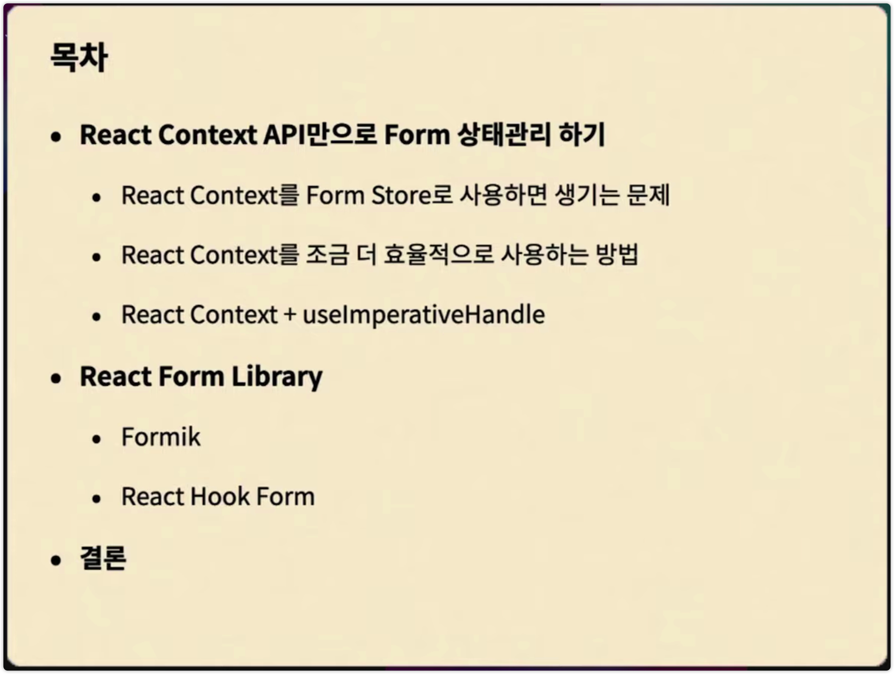

- React Context + `useImperativeHandle` 은 순수 리액트 API로 폼 상태 관리를 구현할 수 있는 최후의 수단이라고 생각하셨다고 한다.

---

- 백오피스 개발을 할 때 어떻게 하면 빠르게 요구사항을 구현할 수 있을지 고민했고, Context를 Form의 요소를 관리하는 상태 셋으로 사용하면 될 것이라고 생각하였다.
- 먼저 그 이유로 Props drilling을 피하기 위해서라고 했는데, 상태를 공유하는 요소들의 계층이 많았고 컴포넌트가 다이나믹하기까지 했기 때문이었다.
- 두 번째로 Form 자체를 Submit할 경우 아무리 많은 요소가 있다고 하더라도 하나로 값을 모을 수 있으리라 기대했다.
- 다른 상태 관리 라이브러리를 사용할 수도 있었지만 Context API가 공식으로 제공되고 있고, 자신이 개발하는 수준에서는 Context API만으로 충분하다고 판단하였다.
- 사실 이렇게 고려했던 것은 나중에 패착이 되었다고 느꼈는데, 나중에 더 자세히 설명할 예정이다.

---

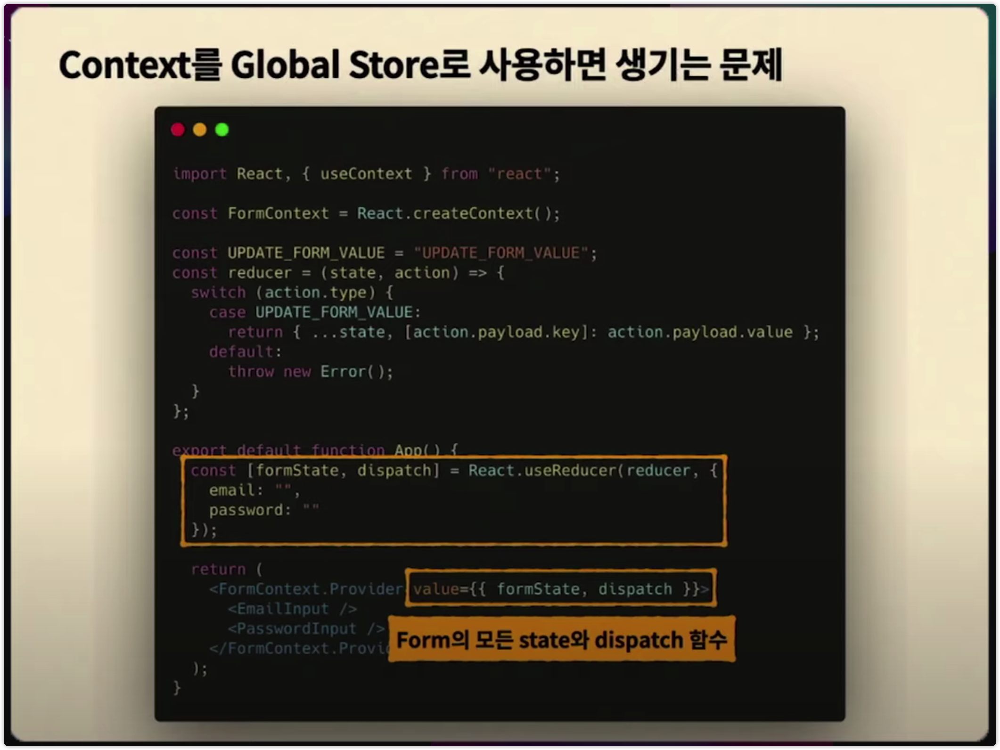

- 최상단에서 `useReducer` 를 사용하여 `formState`, `dispatch` 를 만든 예제
- 다 아시는 것 처럼 위와 같은 코드를 작성하게 되면 해당 Context 아래의 children은 어디서나 `useContext` 를 사용하여 `formState`, `dispatch` 에 접근할 수 있게 된다.

---

- 지금 제공하는 예제는 간단한 수준이지만, 깊이 Nested된 컴포넌트 트리를 상상해보면 이런 방식으로 상태를 가져다 쓰는게 유용할 수도 있다.
- `useContext(FormContext)` 는 보통 실무에서 커스텀 훅 형태로 만들어 사용할 것이지만 이번 발표에서는 생략한다.
- 여기까지 보면 별 문제 없는 코드일 것이라 생각이 된다. 하지만 저 Context를 사용하는 컴포넌트가 지금처럼 2개가 아니라 100개가 된다거나, Context를 사용하는 컴포넌트가 복잡한 비지니스 로직을 담고 있어서 랜더링 시 퍼포먼스가 느릴 경우, 전반적인 앱 퍼포먼스에 문제를 가져올 수 있다. Context 값이 변경될 때마다 `useContext` 를 사용하는 모든 컴포넌트가 리랜더링 되기 때문이다.
  - 즉 `EmailInput` 컴포넌트만 업데이트 하려 했는데, `PasswordInput` 까지 리랜더링 되는 것이다.
  - 한 두개의 input이라면 상관 없지만, 많은 컴포넌트를 사용하거나 계산이 복잡한 컴포넌트일 경우 많은 퍼포먼스 손해를 보게 될 것이다.
- 보통 퍼포먼스 최적화를 위해 리액트 개발자들이 사용하는 방법이 메모이제이션(Memoization)이지만, Context API를 활용하는 경우 이도 활용할 수 없게 된다.
  - 만약 일부 상황에서는 Context가 아니라 Props로 전달하는 방식으로 상태를 전달하면 메모이제이션을 활용할 수 있지만, 되도록이면 Props drilling을 피하고 싶었다.
- 사용하는 기술에 대한 정확한 이해 없이 개발을 한다면 그에 따른 큰 책임이 뒤따르게 된다는 것을 느끼게 되었다.
- 정리하자면
  - `formState` 의 규모가 커지면 커질 수록, `useContext` 를 많이 쓸 수록, 불필요한 리랜더는 계속 증가한다.
  - 그리고 불필요한 리랜더가 계속 증가할 수록 서비스 사용자의 불편함이 증가할 확률이 커지게 된다.

---

- 그래도 조금 신경을 쓰면 Context API를 활용하여 폼 상태 스토어를 만들 수 있을 것이라 생각했다.
- 자주 업데이트 되는 상태는 독립적인 상태로 관리하고 Context의 상태 업데이트는 debounce를 적용하도록 해 보았다.
- 텍스트 인풋 처럼 자주 업데이트가 발생하는 경우나 실제 ref가 노출되는 인풋들은 Uncontrolled로 관리하게 되면 Context 상태 업데이트를 최대한 줄여서 퍼포먼스를 개선시킬 수 있었다.
- 앞선 예세는 한 Context에서 state, dispatch를 같이 넘겨 주었으나, 실제로는 상태만 필요한 경우, 디스패치만 필요한 경우가 따로 있기 때문에 나누어서 퍼포먼스 개선을 꾀할 수 있었다.

---

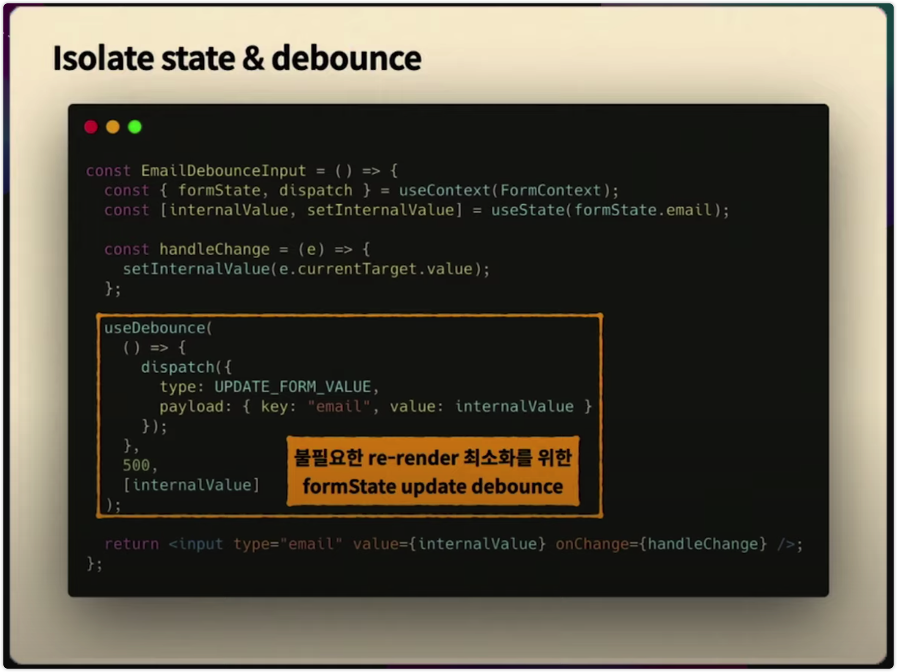

- 위의 경우를 조금 더 자세히 설명하자면, `EmailInput` 컴포넌트를 리팩터링한 모습이다. 여기서 내부 인풋 값은 `useState` 를 통해 관리하고, 그 값이 업데이트 되는 것을 별도의 훅으로 debounce 처리한 것을 볼 수 있다.
- 여기서 유의할 점이 있는데, 딜레이 입력이 적용되기 때문에 사용자가 인지하고 있는 값과 실제 `formState` 의 값은 다를 수 있다는 것을 인지하고 있어야 한다.
  - 그래서 실제로 폼을 Submit 하기 전에 상태 동기화가 잘 되었는지 체크하고 제출하는 것이 중요하다.
  - 위의 예제는 500ms의 딜레이가 있기 때문에 이 사이에도 차이가 발생할 수 있다.

---

- Uncontrolled 컴포넌트로 활용하게 된다면 ref를 이용하여 인풋은 자유로이 사용자가 입력하도록 두고, 실제로 Submit을 하는 시점에 ref의 값을 꺼내와 사용할 수 있다.
- 해당 인풋 값이 바뀐다고 하더라도 리랜더가 일어나지 않기 때문에 퍼포먼스 상승 효과를 얻을 수 있다.
- 하지만 단순히 인풋 값을 받아서 폼을 제출하는 것 뿐 아니라 특정 인풋 값의 변화에 따라 다른 인풋도 바뀌어야 하는 다이나믹한 폼을 만들 때는 적용하기 어렵다. (추가적인 작업이 필요)

---

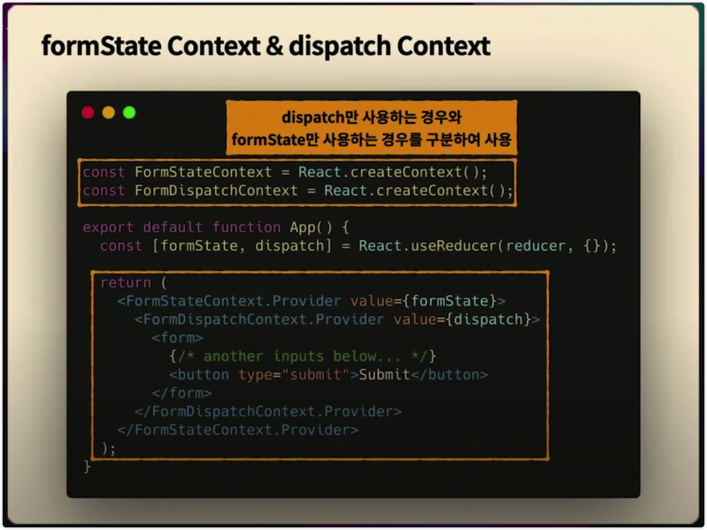

- 어떤 컴포넌트는 `dispatch` 함수만 필요할 수 있고, 어떤 컴포넌트는 `formState` 만 필요할 수 있다. 이를 통해 `dispatch` 만 사용하는 컴포넌트는 불필요한 리랜더를 피할 수 있다.
- 하지만 여전히 `formState` 가 변할 때마다 Context를 사용하는 모든 컴포넌트가 리랜더링 된다는 근본적인 문제 자체는 해결이 되지 않는다.
- 따라서 Context API를 사용하여 상태 관리를 할 경우, 모든 children이 `useContext` 를 쓰기 보다, 적절히 Props로 상태를 전달해주고 `React.memo` 등을 사용하여 메모이제이션을 해 주어야 퍼포먼스를 최적화 할 수 있다.

지금까지 소개한 방법으로 적당한 퍼포먼스가 확보된다면 이대로 개발해도 별로 문제는 없을 것이다. 하지만 위와 같은 방법을 모두 사용해도 굉장히 복잡한 Form의 경우는 퍼포먼스 문제가 여전히 발생할 수 있다. 이럴 때는 결국 Context 사용을 포기해야 하는가? 아니면 다른 라이브러리 등을 사용해야 하는가?

---

- 각자 필요한 상태는 각자 컴포넌트의 스코프로 가지고 있고, 나중에 한번에 모아서 쓸 수 있는 방법이 없을까 고민하였다. 그러다 `useImperativeHandle` 이라는 훅이 제공된다는 것을 알게 되었다.
- 리액트는 단방향으로 상태를 전달하는 것이 기본이지만, 이 훅을 사용한다면 이를 우회할 수 있을 것이라 생각했다. 하지만 공식 문서에서 소개하는 대로 여기저기 이 훅을 사용한다면 앱의 복잡도가 올라가고 디버깅이 어려워질 수 있다. 따라서 정말 필요한 곳에만 사용할 수 있도록 주의해야 한다.

---

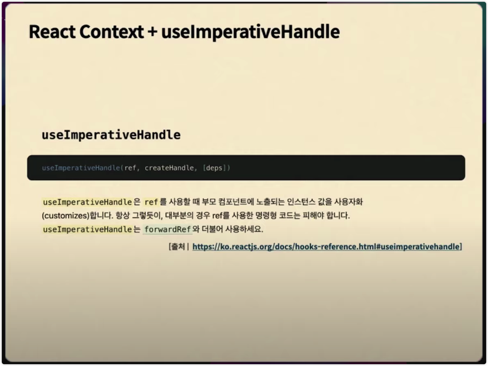

- `useImperativeHandle` 이란 부모 컴포넌트에서 전달해준 ref를 자손 컴포넌트에서 커스터마이징 해줄 수 있다.
- 이를 통해 부모 컴포넌트의 상태나 setState 함수 등을 자손에 전달해주거나 자손의 상태를 부모에서 직접적으로 관리할 수도 있게 한다.

---

- 한 곳에 각각의 컴포넌트의 상태를 모을 수 있는 스토어를 가진 `FormService` 를 만들었다.
- 스토어에 저장된 ref가 있으면 ref를 리턴하고, 아니면 새로 생성하여 각 컴포넌트에 전달해주는 메서드를 만들었다.
- 자손 컴포넌트에서는 `FormService` 를 사용하여 ref를 생성하고 그 ref를 `useImperativeHandle` 을 사용하여 스스로의 value 상태를 커스터마이징하여 사용할 수 있게 되었다. 그리고 submit을 하는 경우 등록된 모든 ref에 접근할 수 있게 되었다.

---

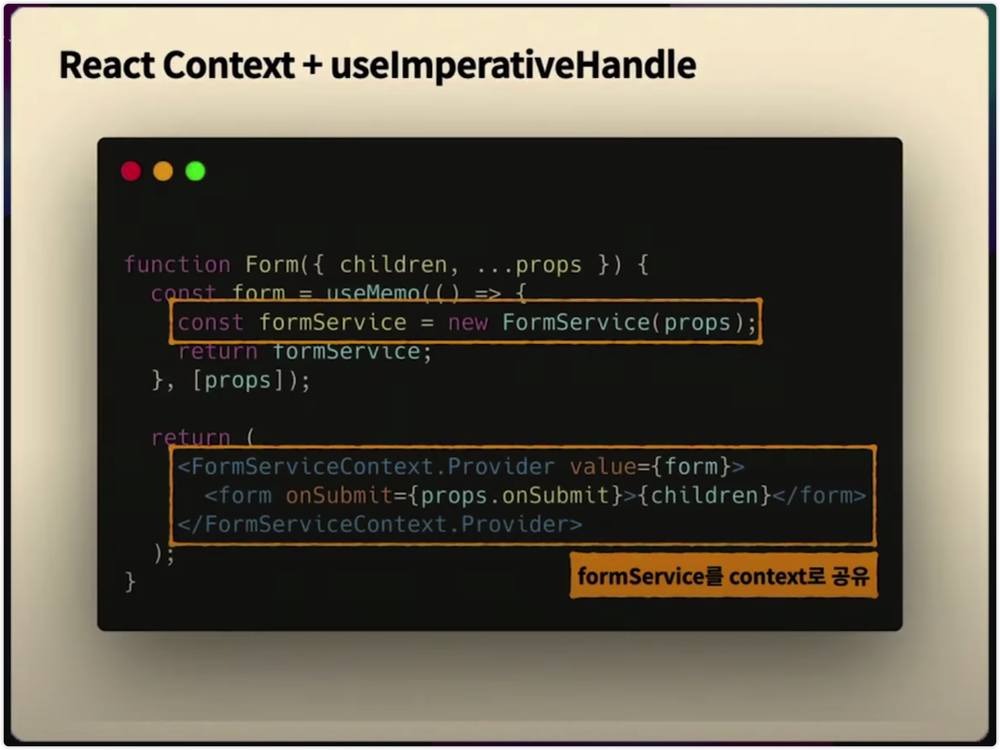

- 다음으로 `Form` 이라는 컴포넌트를 만들었다. Context를 이용하여 해당 `FormService` 를 사용하려는 자손 컴포넌트가 어디서나 `FormService` 에 접근할 수 있도록 하였다.

---

- `FormItem` 은 해당 컴포넌트에 종속되는 상태를 구성하고, `FormService` 를 통해 만들어진 ref를 커스터마이징 하기 위하여 `useImperativeHandle` 을 사용하고 있다. 여기서는 간단히 보여주기 위해 value, setValue, 그리고 해당 DOM의 ref만 전달해주고 있다.
- 실제 코드가 사용될 때는 validation 등의 다양한 유스케이스가 있으므로 error 등의 상태도 전달하게 될 것이다.

---

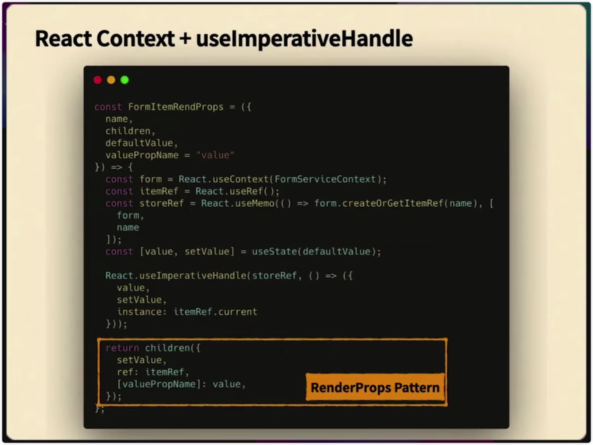

- 이전 예시에서는 `FormItem` 이 단순히 children의 컨테이너 역할을 하였지만, 이렇게 render props 패턴을 활용하면 더 다양한 유스케이스에 대응할 수 있게 된다.

---

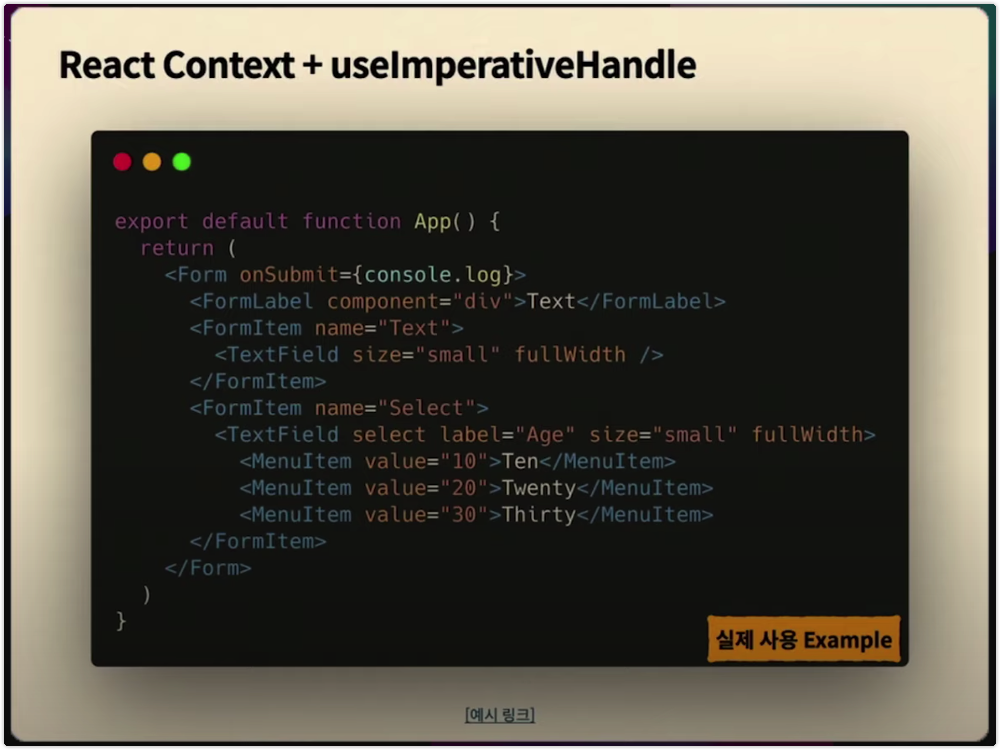

- 위의 에제 코드를 조합하여 다음과 같은 폼을 만들어 퍼포먼스 문제가 없는 폼을 구성할 수 있게 되었다.
- 자세한 구현체는 [여기서](https://github.com/seonghyeonkimm/react-form) 확인해볼 수 있다.

---

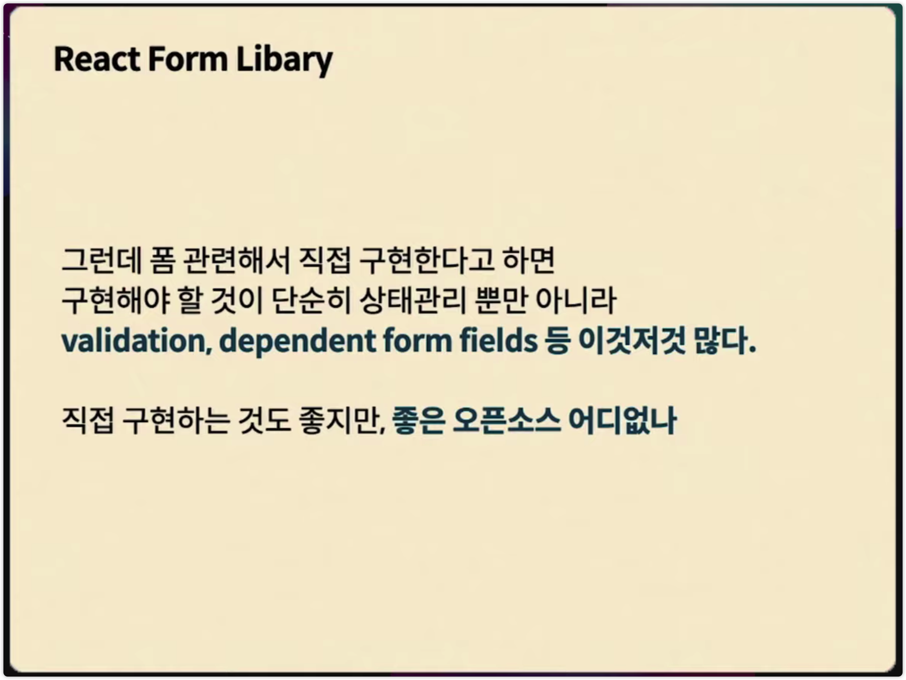

- 하지만 직접 폼 상태 관리를 구현한다고 하면 유효성 검사, 다른 폼 필드에 의존적인 폼 필드 등 복잡한 로직을 구현하는 것이 쉽지 않을 수 있다. 
- 그래서 이미 구현된 오픈소스 프로젝트를 활용해보고, 거기서 부족함을 느낀다면 직접 구현해보는 것을 추천한다.
- 이미 많은 사람들이 알고 있을 테지만 유명한 리액트 폼 라이브러리를 사용해보고 느낀 경험에 대해 정리해보고자 한다.

---

- 구글에서 '리액트 폼 라이브러리' 를 검색하면 가장 먼저 나오는 것이 React Hook Form이다. 이전에는 Formik이 많이 사용되었다.

---

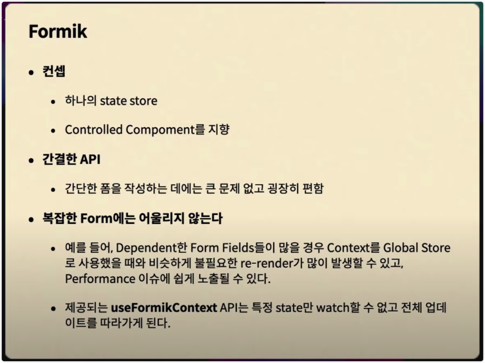

- 폼 관련 상태를 관리하는 방식
- 발표자가 앞서 설명했던 것 처럼 폼 상태를 Context로 관리하는 것과 유사한 형태
- 기본적으로 Controlled Component 지향
- API가 간결하여 금방 배워서 빠르게 적용할 수 있다.
- 특정 폼 필드가 의존적인 복잡한 폼 필드를 다루어야 할 때는 `useFormikContext` 를 사용하게 되는데, 이 경우는 발표 앞 부분에서 설명했던 Context로 폼 상태를 다룰 때의 문제를 그대로 겪게 된다.
- 실제 Github issue를 살펴보면 퍼포먼스 이슈에 대한 질문이 많이 눈에 띈다.
- 간단하고 작은 규모의 폼을 구성할 때는 괜찮을 수 있으나, 백오피스에 사용되는 복잡한 폼을 구현해야 한다면 적절하지 않다고 여긴다. 퍼포먼스 개선을 위한 개발이 꾸준히 이루어지고 있긴 하지만 지금 시점에서는 해결되지 않았다.

---

- 실제 사용 예를 보면, 초기 Context 관련 예시와 비슷하게 `Formik` 이라는 Provider 역할을 하는 컴포넌트로 감싸고, `Field` 라는 컴포넌트를 통하여 인풋을 형성한다.
- 대체로 간단한 폼을 만드는데는 문제가 없지만, 다른 폼 필드에 따라 변화가 발생해야 한다면, 두 번째 사진과 같은 예시를 작성할 수 있다. `textA` 라는 필드의 값에 따라 B 필드의 값이 변화하는 예제이다.
- 이 경우에 Context API를 사용하는 만큼, 사용하는 인풋 갯수가 많아질수록 불필요한 리랜더를 겪게 될 것이다.

---

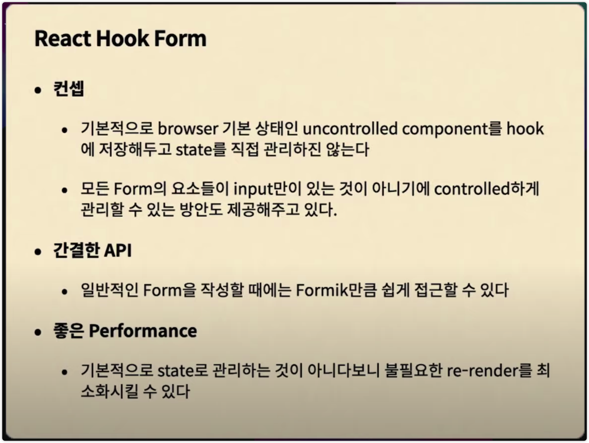

- React Hook Form(RHF)는 발표 초반에 이야기했던 Uncontrolled 컴포넌트와 Controlled 컴포넌트를 복합적으로 사용한다.
- 인풋의 값을 활용하기 위해 ref를 해당 DOM에 등록하여 사용한다. 하지만 대부분의 폼은 Uncontrolled 하게 다루는 경우가 드물기 때문에 Controlled하게 관리할 수 있는 방안도 제공하고 있다.
- 일반적인 폼을 구성하는데는 Formik과 비슷한 수준으로 쉽지만, 복잡한 폼을 다룰 때는 신경써야 할 부분이 조금 많다. RHF는 Uncontrolled 한 부분이 섞여있기 때문이다.
- RHF는 하나의 스토어에 모든 등록된 아이템의 ref를 모아두고 나중에 submit할 때 사용하기 때문에 좋은 퍼포먼스를 가지고 있다. 불필요한 리랜더를 최소화할 수 있다고 스스로를 소개하고 있다. 또한 dependent form field 개발 시에도 특정 값만 watch를 할 수 있기 때문에 좋은 퍼포먼스를 유지할 수 있다. 발표자가 아는 한에서 가장 괜찮은 퍼포먼스를 유지할 수 있다.

---

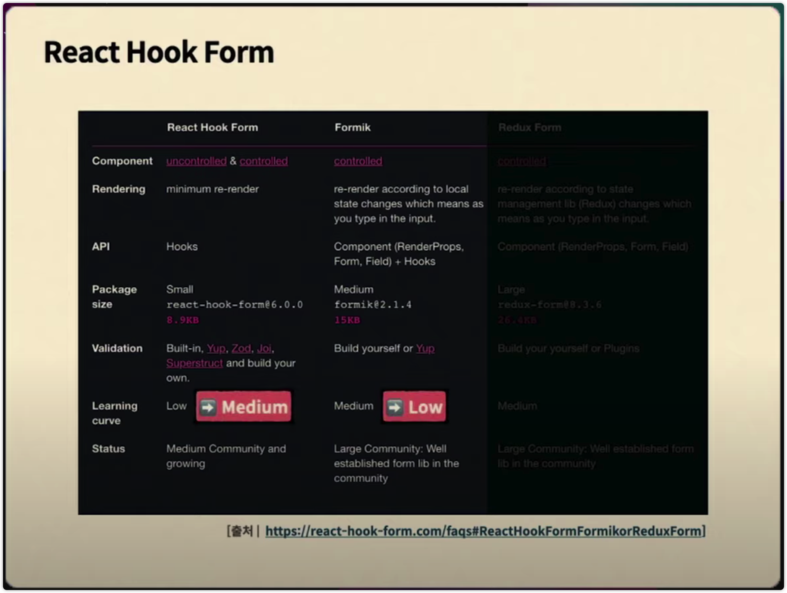

- RHF의 문서 페이지를 보면 대채적으로 맞는 설명을 하고 있다고 느끼지만, Learning curve 부분에서 간단한 폼을 만들 때는 Formik 이 오히려 더 쉽고 복잡한 폼을 구현할 때는 RHF가 알아야 할 것이 생각보다 많다고 느꼈다.
- 커뮤니티 규모는 Formik이 이미 크다고 하지만 관리가 안되는 느낌이 강했고, 오히려 RHF의 경우 메인테이너들이 빠르고 적극적으로 답변해주는데다 커뮤니티도 꾸준히 성장하고 있어서 더 괜찮다고 생각하였다.

---

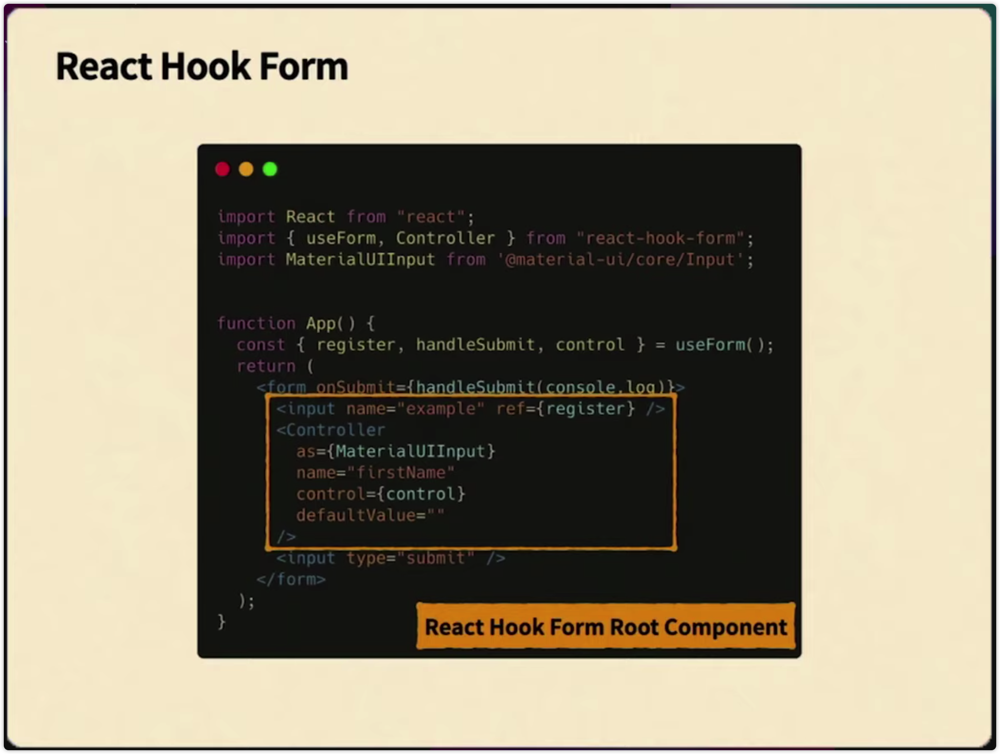

- 모든 API가 훅으로 이루어져 있으며 폼의 최상위 컴포넌트에서 `useForm` 으로 시작을 하게 된다.
- 등록하려는 인풋에 ref를 전달할 수 있으면 `register` 함수를 전달하면 된다.
- ref에 접근할 수 없는 컴포넌트의 경우 `Controller` 라는 컴포넌트를 별도로 제공하기 때문에 Controlled 컴포넌트도 쉽게 접근할 수 있다.

---

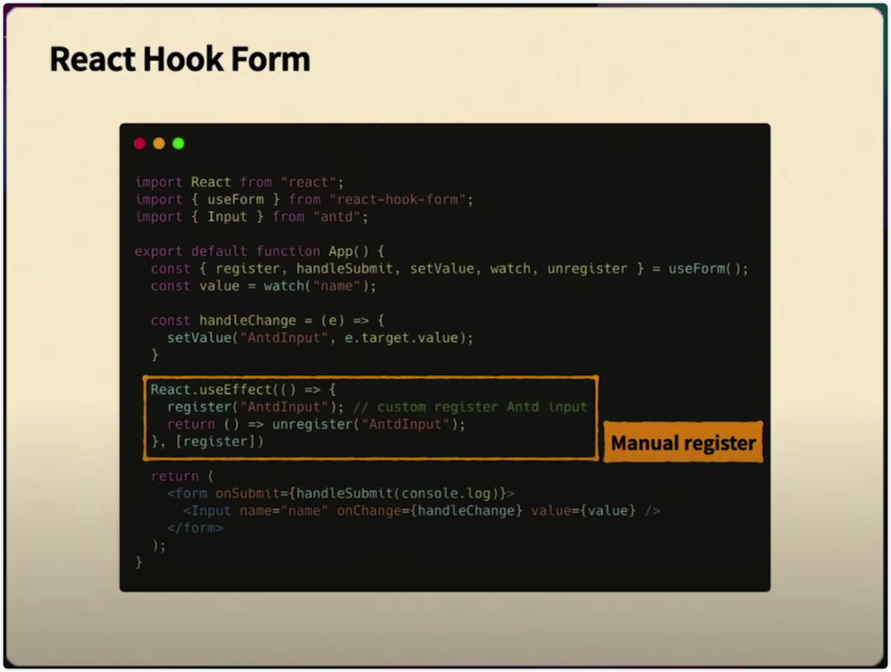

- Controller 컴포넌트를 사용하지 않고, 직접 등록하여 사용하는 방법도 가지고 있다.
- 고유의 `name` 만 가지고 있다면 `register` 함수를 통하여 등록하고, 제공되는 `setValue` 를 통하여 폼 값을 수정할 수 있다.
- 여기서 유의할 점이 있는데, RHF의 `setValue` 는 `setState` 와는 다른 것이라, 값이 바로 업데이트 되는 것이 아니기 때문에 동기화를 신경써주어야 한다.
- 이럴 때를 위해 `watch` 라는 함수를 이용하여 원하는 인풋 값을 바로바로 관찰하여 활용할 수 있다.

---

- `defaultValues` 를 사용할 때 주의할 점이 있는데 RHF는 `register` 된 값만 사용되기 때문에, 다음과 같은 코드에서 혼란스러운 부분이 있다. 초기에 값을 설정하였다 하더라도 마운트 시에 register 하지 않았다면 그 값은 버려지기 때문이다.
- 특정 아이템의 `name` 을 API에서 받아와 `defaultValue` 로 설정했다고 가정할 때 때 인풋의 값은 `name` 들만 등록되게 된다. 이렇게 되었을 때 실제 폼을 제출하면 `id` 값은 사용자 입장에서 필요한 값임에도 불구하고 폼 제출시 넘어오지 않는다.

---

- 실제로 `id` 값도 필요한 경우 그 값도 RHF가 알 수 있도록 인풋을 만들어서 `register` 를 해 주어야 한다.
- 이 경우 사용자는 직접적으로 이 인풋을 볼 필요가 없기 때문에 스타일 처리는 별도로 할 필요가 있다.

---

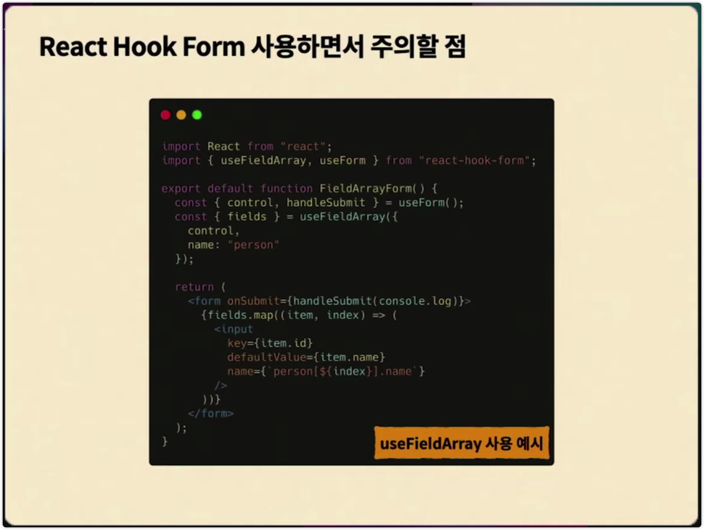

- 마지막으로 배열 필드로 다루기 위해 `useFieldArray` 라는 훅도 제공한다.
- 예제에는 나오지 않았지만 `append`, `remove` 등 배열 필드를 쉽게 다룰 수 있는 다양한 방법을 제공한다.

---

- 해당 배열 필드 안에 있는 값이 변화했을 때 다른 액션을 취할 수 있도록 `useWatch` 를 제공하긴 하지만, 발표자의 사례처럼 배열의 길이만 변화했을 때를 감지하는 것이 불가능하기 때문에 무조건 전체 배열 필드를 관찰할 수 밖에 없었다.
- 이 경우 단순히 필드의 수 뿐 아니라 배열 필드 내부의 값이 변화했을 때도 리랜더가 일어나기 때문에 퍼포먼스 손해가 발생한다. 이런 문제를 극복하기 위해서는 추가적인 작업이 필요해진다.

---

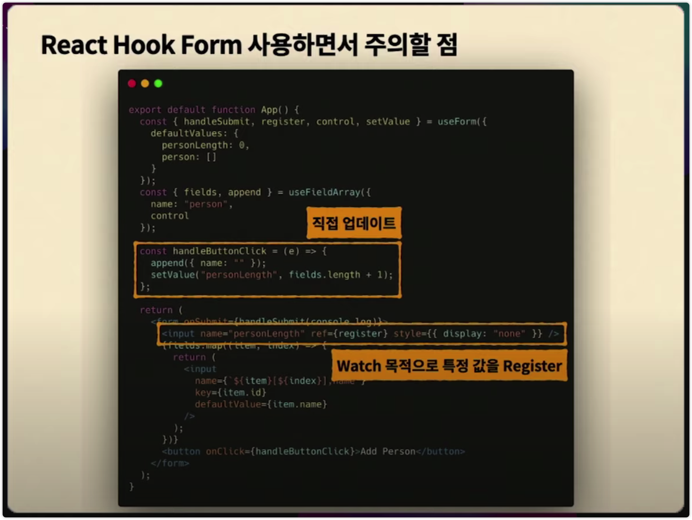

- 그래서 위의 문제를 해결하기 위해 길이만 다루는 필드를 따로 만들어서, 필드 길이 변화에 따라 직접 업데이트를 수행하도록 로직을 구성할 수 있다.
- 하지만 이럴 경우 실제 폼 제출 시 사용되지 않는 값임에도 불구하고 필드 생성, `register`, 값 업데이트 등을 수동으로 관리해주어야 하는 불편함을 감수해야 한다.
- RHF를 사용할 때는 폼 요스의 ref를 등록하고 그 ref 를 통해 관리한다는 기본 개념을 이해해야 하며, 등록되지 않는 값을 사용할 때는 커스텀하게 등록해주는 과정이 필요하다는 것을 인지해야 한다. 커스텀하게 watch할 값을 구성할 때도 해당 값을 등록해서 사용해주어야 한다.

---

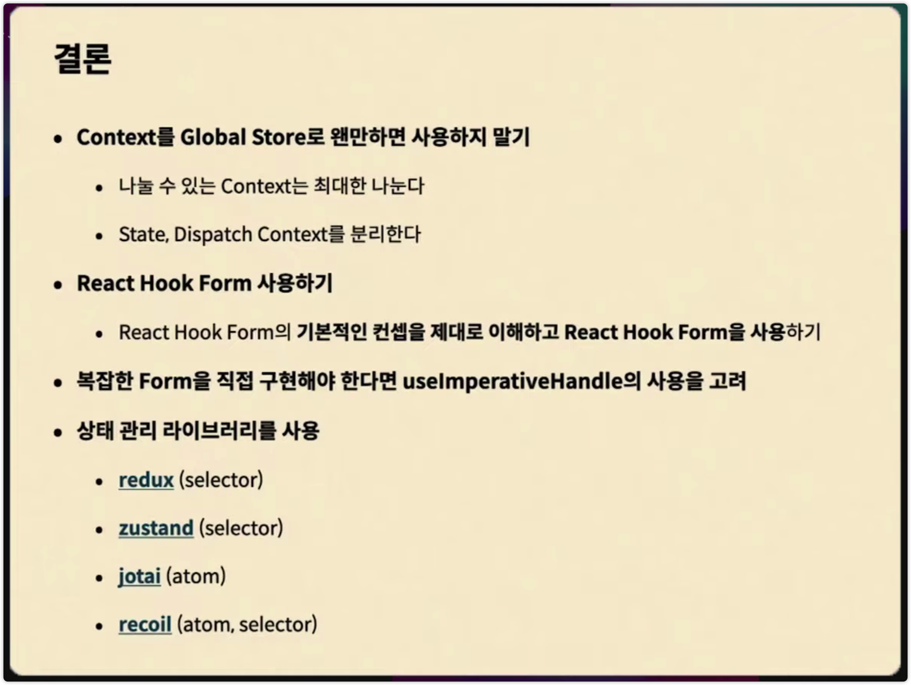

- 구현해야 하는 내용에 따라 가장 효율적인 퍼포먼스를 낼 수 있는 방식을 선택해야 할 것이다.
- 간단한 폼을 만들 때는 괜찮지만, 복잡한 폼을 구성한다면 Context를 직접적으로 사용하는 것은 지양해야 한다.
- 라이브러리를 사용하여 복잡한 폼을 구현한다고 하면, RHF를 추천한다.
- 구현해야 하는 내용이 RHF만으로 충분하다면 괜찮지만, 더 복잡한 폼을 다루어야 한다면 `useImperativeHandle` 을 고려해볼 수도 있을 것이다.
- 아니라면 각자 괜찮은 최적화 방법(selector 등)을 제공하는 상태 관리 라이브러리들을 활용할 수 있다.
